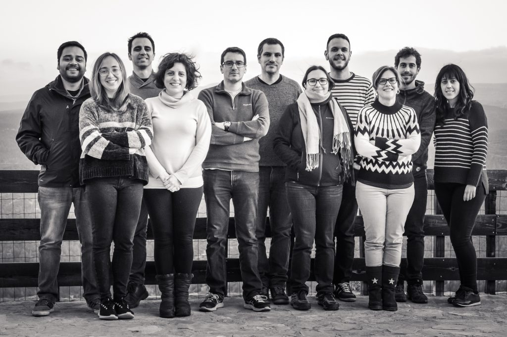

## **Calendario de Lab meeting / Journal club** :microscope:

### **Jueves 16 de septiembre (9:30 am)**
- Tema: "Global phylogenomic analyses of Mycobacterium abscessus provide context for non cystic fibrosis infections and the evolution of antibiotic resistance" :lab_coat: :dna: :scroll:
- Presenta: **Ana García Marín** :es: :cat:
- Modalidad: Journal club - ONLINE
- Links: [Click para Zoom](https://dicv-csic-es.zoom.us/j/87313799199?pwd=MjZBcnZYdWtBOWhXTlBCaWlwWXo3dz09) :movie_camera: y [Click para Paper](https://www.nature.com/articles/s41467-021-25484-9?utm_source=dlvr.it&utm_medium=twitter) :clipboard:

#### **Jueves 01 de julio (9:30 am)**
- Tema: "Re-imaginando la historia natural de la tuberculosis - PARTE 2" :lab_coat: :dna: :scroll:
- Presenta: **Iñaki Comas** :es: :shallow_pan_of_food:
- Modalidad: Lab meeting - ONLINE
- Links: [Click para Zoom](https://dicv-csic-es.zoom.us/j/2060025794?pwd=M1loLzR3RTVHbDY2OGNibk83c1R6Zz09) :movie_camera:

#### **Jueves 10 de junio (9:30 am)**
- Tema: "Re-imaginando la historia natural de la tuberculosis - PARTE 1" :lab_coat: :dna: :scroll:
- Presenta: **Iñaki Comas** :es: :shallow_pan_of_food:
- Modalidad: Lab meeting - ONLINE
- Links: [Click para Zoom](https://dicv-csic-es.zoom.us/j/2060025794?pwd=M1loLzR3RTVHbDY2OGNibk83c1R6Zz09) :movie_camera:

#### **Jueves 20 de mayo (9:00 am)**
- Tema: "Evaluating tuberculosis transmission dynamics in Valencia to define targeted public health actions" :lab_coat: :dna: :microbe:
- Presenta: **Irving Cancino-Muñoz** :mexico: :monocle_face:
- Modalidad: Lab meeting - ONLINE
- Links: [Click para Zoom](https://conectaha.csic.es/b/ina-2qo-r3c-4xc) :movie_camera:

#### **Jueves 6 de mayo (9:30 am)**
- Tema: "CRISPRi: fundamento de la técnica y aplicación en el laboratorio" :lab_coat: :dna:
- Presenta: **Victoria Furió** :es: :biohazard:
- Modalidad: Lab meeting - ONLINE
- Links: [Click para Zoom](https://conectaha.csic.es/b/ina-2qo-r3c-4xc) :movie_camera:

#### **Viernes 23 de abril (9:30 am)**
- Tema: "Preparación de librerías de NGS" :lab_coat: :dna:
- Presenta: **Manuela Torres-Puente** :es: :boot: :woman_scientist:
- Modalidad: Lab meeting - ONLINE
- Links: [Click para Zoom](https://us02web.zoom.us/j/83166525016?pwd=c2tDbUZ3Ni8rQ29KM0UwNm51aWtlQT09) :movie_camera:

#### Jueves 15 abril (9:30 am)
- Tema: "Posible asunto relacionado con TB" (Progress of the tuberculosis and COVID-19 projects) :dna:
- Presenta: **Álvaro Chiner-Oms** :es: :circus_tent:
- Modalidad: Lab meeting - ONLINE
- Links: [Click para Zoom](https://us02web.zoom.us/j/83166525016?pwd=c2tDbUZ3Ni8rQ29KM0UwNm51aWtlQT09) :movie_camera:

#### Miercoles 31 marzo (9:30 am)
- Tema: "Paper de coronavirus o la última cosa de TB" (Progress of the tuberculosis and COVID-19 projects) :dna:
- Presenta: **Álvaro Chiner-Oms** :es: :circus_tent:
- Modalidad: Lab meeting - ONLINE
- Links: [Click para Zoom](https://us02web.zoom.us/j/83166525016?pwd=c2tDbUZ3Ni8rQ29KM0UwNm51aWtlQT09) :movie_camera: y [Click para Paper]() :clipboard:

- Opción democrática para elegir al siguiente participante: [Click aqui](https://www.random.org/lists/)
- Opción no democrática: Voluntarios o Afortunados

##### Participantes:

- Francisco
- Carla
- Carlos
- Miguel
- Luis
- Mariana
- Belen
- Santi
- Inma
- Manoli
- Pablo

##### Ya se han agendado:

- Iñaki :es: :shallow_pan_of_food:
- Irving :mexico: :monocle_face:
- Vicky :es: :biohazard:
- Manoli :es: :boot:
- Alvaro :es: :circus_tent:
- Ana :es: :cat:
- Galo :switzerland:
