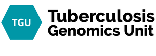

## **Calendario de Lab meeting / Journal club** :microscope:

### **Jueves 15 abril (9:30 am)**
- Tema: "Posible asunto relacionado con TB" :dna:
- Presenta: **Álvaro Chiner-Oms** :es: :circus_tent:
- Modalidad: Lab meeting - ONLINE
- Links: [Click para Zoom](https://us02web.zoom.us/j/83166525016?pwd=c2tDbUZ3Ni8rQ29KM0UwNm51aWtlQT09) :movie_camera:

#### Miercoles 31 marzo (9:30 am)
- Tema: "Paper de coronavirus o la última cosa de TB" :dna:
- Presenta: **Álvaro Chiner-Oms** :es: :circus_tent:
- Modalidad: Lab meeting - ONLINE
- Links: [Click para Zoom](https://us02web.zoom.us/j/83166525016?pwd=c2tDbUZ3Ni8rQ29KM0UwNm51aWtlQT09) :movie_camera: y [Click para Paper]() :clipboard:

Opcion democratica para elegir al siguiente participante: [Click aqui](https://www.random.org/lists/)

##### Participantes:

  - Francisco
  - Vicky
  - Carla
  - Carlos
  - Miguel
  - Luis
  - Mariana
  - Irving

##### No Participantes?:

  - Alvaro
  - Ana
  - Santi
  - Inma
  - Manoli
  - Iñaki
