## **New_Frecuencias**
### Tabla de New_Frecuencias de los 16 genotipos
|Genotipo|N  |Sp |For|NA_|Sp_x |For_x|NA_x |N_incluster|Sp_incluster|For_incluster|NA_incluster|Sp_incluster_x|For_incluster_x|NA_incluster_x|
|--------|---|---|---|---|-----|-----|-----|-----------|------------|-------------|------------|--------------|---------------|--------------|
|1       |109|69 |36 |4  |0.633|0.330|0.037|59         |41          |15           |3           |0.695         |0.254          |0.051         |
|2       |218|132|70 |16 |0.606|0.321|0.073|118        |73          |32           |13          |0.619         |0.271          |0.110         |
|3       |66 |33 |31 |2  |0.500|0.470|0.030|43         |25          |17           |1           |0.581         |0.395          |0.023         |
|4       |89 |61 |23 |5  |0.685|0.258|0.056|29         |20          |6            |3           |0.690         |0.207          |0.103         |
|5       |66 |52 |8  |6  |0.788|0.121|0.091|31         |27          |1            |3           |0.871         |0.032          |0.097         |
|6       |98 |47 |44 |7  |0.480|0.449|0.071|61         |37          |17           |7           |0.607         |0.279          |0.115         |
|7       |79 |56 |20 |3  |0.709|0.253|0.038|49         |38          |11           |0           |0.776         |0.224          |0.000         |
|8       |151|110|38 |3  |0.728|0.252|0.020|69         |51          |15           |3           |0.739         |0.217          |0.043         |
|9       |75 |55 |15 |5  |0.733|0.200|0.067|33         |27          |4            |2           |0.818         |0.121          |0.061         |
|10      |96 |46 |41 |9  |0.479|0.427|0.094|54         |32          |16           |6           |0.593         |0.296          |0.111         |
|11      |21 |5  |14 |2  |0.238|0.667|0.095|10         |2           |7            |1           |0.200         |0.700          |0.100         |
|12      |2  |1  |0  |1  |0.500|0.000|0.500|2          |1           |0            |1           |0.500         |0.000          |0.500         |
|13      |15 |5  |10 |0  |0.333|0.667|0.000|7          |4           |3            |0           |0.571         |0.429          |0.000         |
|14      |35 |17 |14 |4  |0.486|0.400|0.114|16         |7           |5            |4           |0.438         |0.312          |0.250         |
|15      |30 |20 |7  |3  |0.667|0.233|0.100|8          |6           |0            |2           |0.750         |0.000          |0.250         |
|16      |27 |3  |21 |3  |0.111|0.778|0.111|11         |1           |8            |2           |0.091         |0.727          |0.182         |

- Genotipo = Genotipo
- N = Total de casos
- Sp = Total de casos españoles
- For = Total de casos extranjeros
- NA_ = Total de casos NA
  - Sp_x = Proporcion de españoles en el genotipo
  - For_x = Proporcion de extranjeros en el genotipo
  - NA_x = Proporcion de NA en el genotipo
- N_incluster = Total de casos en clusters de transmisión
  - Sp_incluster = Numero de españoles en clusters de transmisión
  - For_incluster = Numero de extranjeros en clusters de transmisión
  - NA_incluster = Numero de NA en clusters de transmisión
  - Sp_incluster_x = Proporción de "Sp_incluster" en relacion a "N_incluster"
  - For_incluster_x = Proporción de "For_incluster" en relacion a "N_incluster"
  - NA_incluster_x = Proporción de "NA_incluster" en relacion a "N_incluster"

### Genero un subset al descartar genotipos por diferentes razones
- N < 25 (12, 13, 11)
- Na_x > 0.1 (12, 14, 16, 15)
- NA_incluster_x > 0.15 (12,14,15,16)
- Numero de clusters < 6 (11, 12, 13, 14, 15, 16)

|Genotipo|N  |Sp |For|NA_|Sp_x |For_x|NA_x |N_incluster|Sp_incluster|For_incluster|NA_incluster|Sp_incluster_x|For_incluster_x|NA_incluster_x|
|--------|---|---|---|---|-----|-----|-----|-----------|------------|-------------|------------|--------------|---------------|--------------|
|1       |109|69 |36 |4  |0.633|0.330|0.037|59         |41          |15           |3           |0.695         |0.254          |0.051         |
|2       |218|132|70 |16 |0.606|0.321|0.073|118        |73          |32           |13          |0.619         |0.271          |0.110         |
|3       |66 |33 |31 |2  |0.500|0.470|0.030|43         |25          |17           |1           |0.581         |0.395          |0.023         |
|4       |89 |61 |23 |5  |0.685|0.258|0.056|29         |20          |6            |3           |0.690         |0.207          |0.103         |
|5       |66 |52 |8  |6  |0.788|0.121|0.091|31         |27          |1            |3           |0.871         |0.032          |0.097         |
|6       |98 |47 |44 |7  |0.480|0.449|0.071|61         |37          |17           |7           |0.607         |0.279          |0.115         |
|7       |79 |56 |20 |3  |0.709|0.253|0.038|49         |38          |11           |0           |0.776         |0.224          |0.000         |
|8       |151|110|38 |3  |0.728|0.252|0.020|69         |51          |15           |3           |0.739         |0.217          |0.043         |
|9       |75 |55 |15 |5  |0.733|0.200|0.067|33         |27          |4            |2           |0.818         |0.121          |0.061         |
|10      |96 |46 |41 |9  |0.479|0.427|0.094|54         |32          |16           |6           |0.593         |0.296          |0.111         |

### Grafico Spanish in cluster (%) VS Foreing in cluster (%)

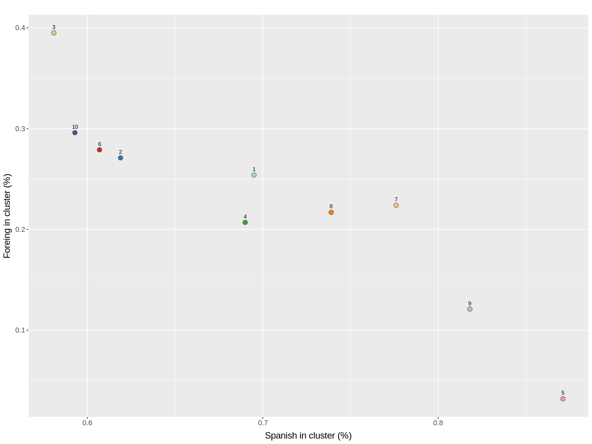

- Spanish in cluster (%) = Sp_incluster_x = Proporción de "Sp_incluster" en relacion a "N_incluster"
- Foreing in cluster (%) = For_incluster_x = Proporción de "For_incluster" en relacion a "N_incluster"

> Agrupo genotipos > 70% Spanish in cluster

|Genotipos   |Sp_incluster|For_incluster|Odds |pvalue|
|------------|------------|-------------|-----|------|
|5,9,7,8     |143         |31           |2.081|0.001 |
|1,4,2,6,10,3|228         |103          |ref  |ref   |

### Grafico Spanish cluster cases (%) VS Foreing cluster cases (%)
#### Tabla_only_cases_cluster

|Genotipo|N_incluster|Spanish_cluster_cases|%    |Foreing_cluster_cases|%    |Mixes_cluster_cases|%    |Na_cluster_cases|%    |
|--------|-----------|---------------------|-----|---------------------|-----|-------------------|-----|----------------|-----|
|1       |59         |19                   |0.322|2                    |0.034|32                 |0.542|6               |0.102|
|2       |118        |30                   |0.254|7                    |0.059|37                 |0.314|44              |0.373|
|3       |43         |15                   |0.349|8                    |0.186|18                 |0.419|2               |0.047|
|4       |29         |13                   |0.448|4                    |0.138|5                  |0.172|7               |0.241|
|5       |31         |23                   |0.742|0                    |0.000|0                  |0.000|8               |0.258|
|6       |61         |4                    |0.066|9                    |0.148|12                 |0.197|36              |0.590|
|7       |49         |18                   |0.367|0                    |0.000|31                 |0.633|0               |0.000|
|8       |69         |35                   |0.507|3                    |0.043|24                 |0.348|7               |0.101|
|9       |33         |17                   |0.515|2                    |0.061|6                  |0.182|8               |0.242|
|10      |54         |15                   |0.278|9                    |0.167|9                  |0.167|21              |0.389|

- Genotipo = Genotipo
- N_incluster = Total de casos en clusters de transmición
- Spanish_cluster_cases = Numero de casos españoles en clusters de solo españoles
- Foreing_cluster_cases = Numero de casos extranjeros en clusters de solo extranjeros
- Mixes_cluster_cases = Numero de casos en clusters mixtos
- Na_cluster_cases = Numero de casos en clusters NA
- %

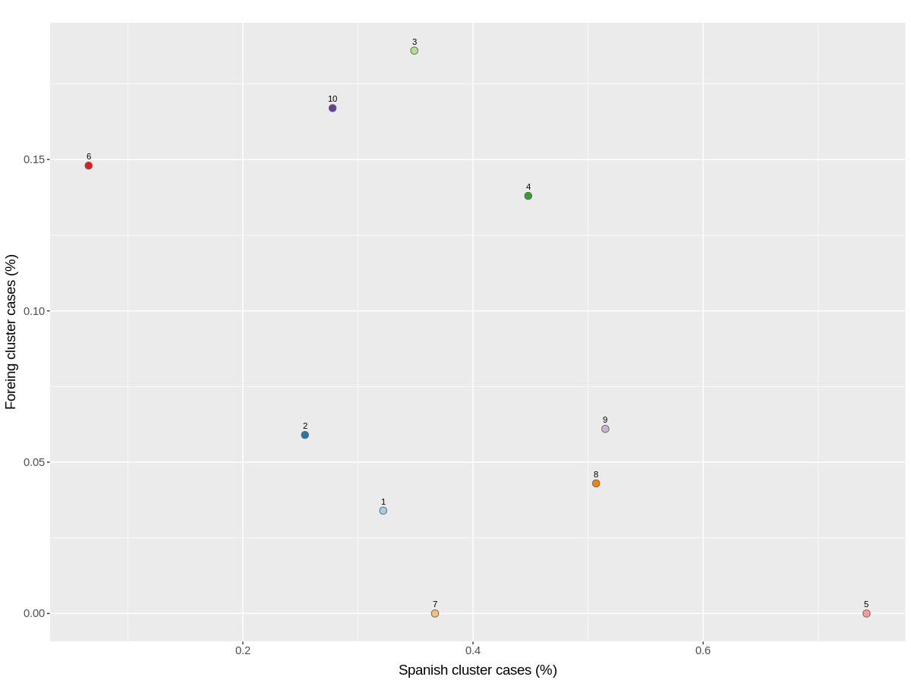

> Agrupo genotipos > 40% Spanish cluster cases

|Genotipos   |Spanish_cluster_cases|Foreing_cluster_cases|Odds |pvalue|
|------------|---------------------|---------------------|-----|------|
|4,5,8,9     |88                   |9                    |3.135|0.002 |
|1,2,3,6,8,10|118                  |38                   |ref  |ref   |

### Tabla de clusters
|Genotipo|Mix|Sp |For|Na |Total|
|--------|---|---|---|---|-----|
|1       |9  |4  |1  |1  |15   |
|2       |13 |8  |3  |11 |35   |
|3       |4  |7  |3  |1  |15   |
|4       |2  |4  |2  |3  |11   |
|5       |0  |5  |0  |2  |7    |
|6       |3  |2  |3  |4  |12   |
|7       |7  |4  |0  |0  |11   |
|8       |5  |14 |1  |3  |23   |
|9       |2  |5  |1  |2  |10   |
|10      |4  |5  |2  |4  |15   |

- Genotipo = Genotipo
- Mix = Numero de clusters mixtos
- Sp = Numero de clusters de solo españoles
- For = Numero de clusters de solo extranjeros
- Na = Numero de clusters NA
- Total = Total de clusters

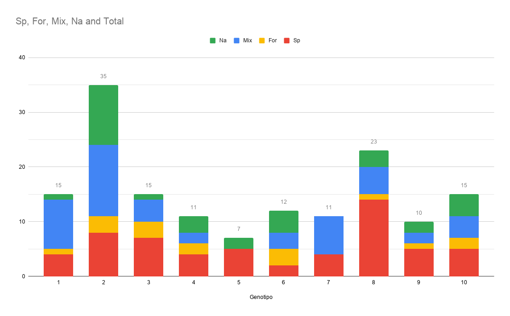
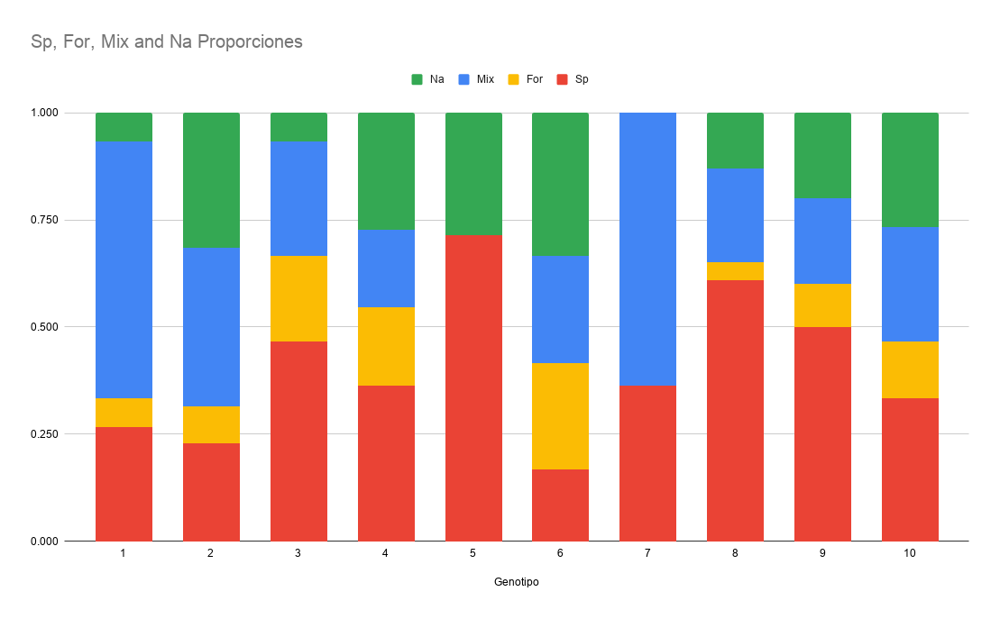

|Genotipo|Sp |Spanish_cluster_cases|
|--------|---|---------------------|
|1       |4  |19                   |
|2       |8  |30                   |
|3       |7  |15                   |
|4       |4  |13                   |
|5       |5  |23                   |
|6       |2  |4                    |
|7       |4  |18                   |
|8       |14 |35                   |
|9       |5  |17                   |
|10      |5  |15                   |

- Genotipo = Genotipo
- Sp = Numero de clusters de solo españoles

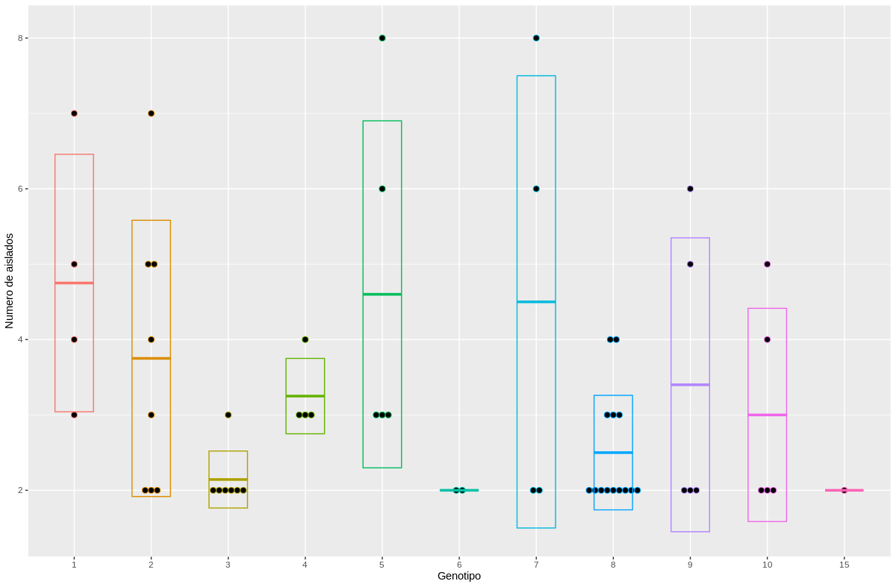

#### Eventos de transmisión en only spanish cluster
|Genotipo|Sp |Eventos|
|--------|---|-------|
|1       |4  |15     |
|2       |8  |22     |
|3       |7  |8      |
|4       |4  |9      |
|5       |5  |18     |
|6       |2  |2      |
|7       |4  |14     |
|8       |14 |21     |
|9       |5  |12     |
|10      |5  |10     |

- Genotipo = Genotipo
- Sp = Numero de clusters de solo españoles
- Eventos = Numero de eventos de transmisión

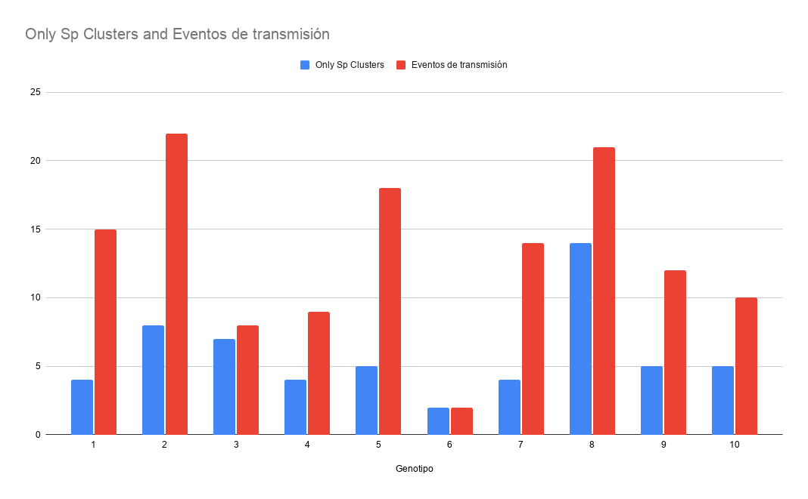

### Genotipos por casos
> 65% de españoles en Genotipos 5,7,8,9

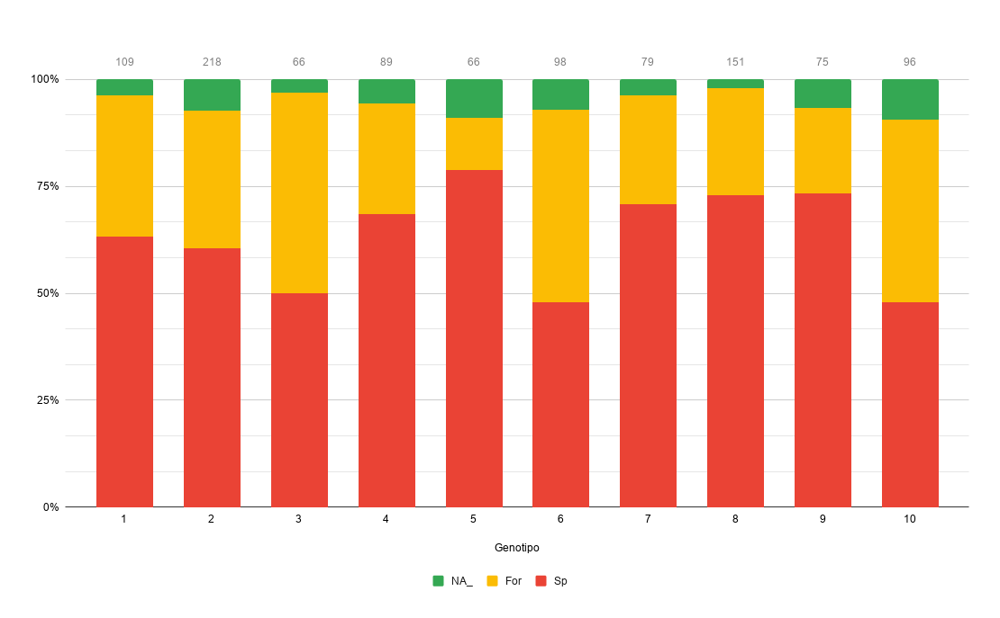

### Genotipos por casos en clusters
> 75% de españoles en cluster en Genotipos 5,8,9

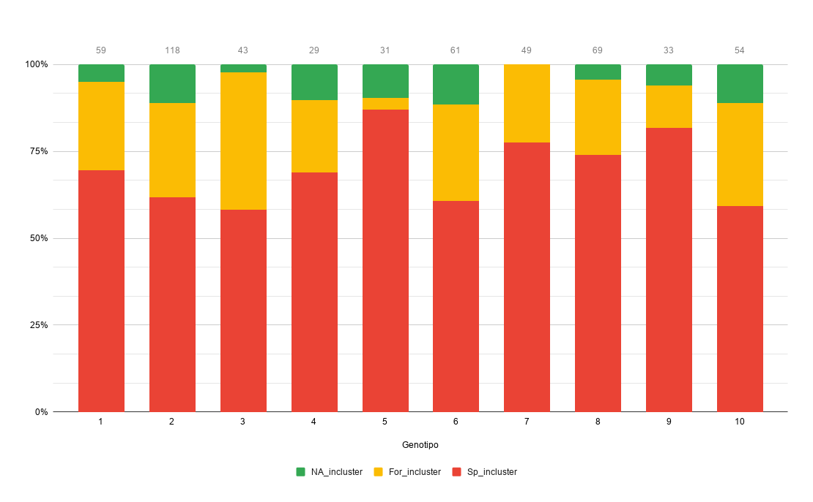

### Grafico Sp_incluster VS Sp

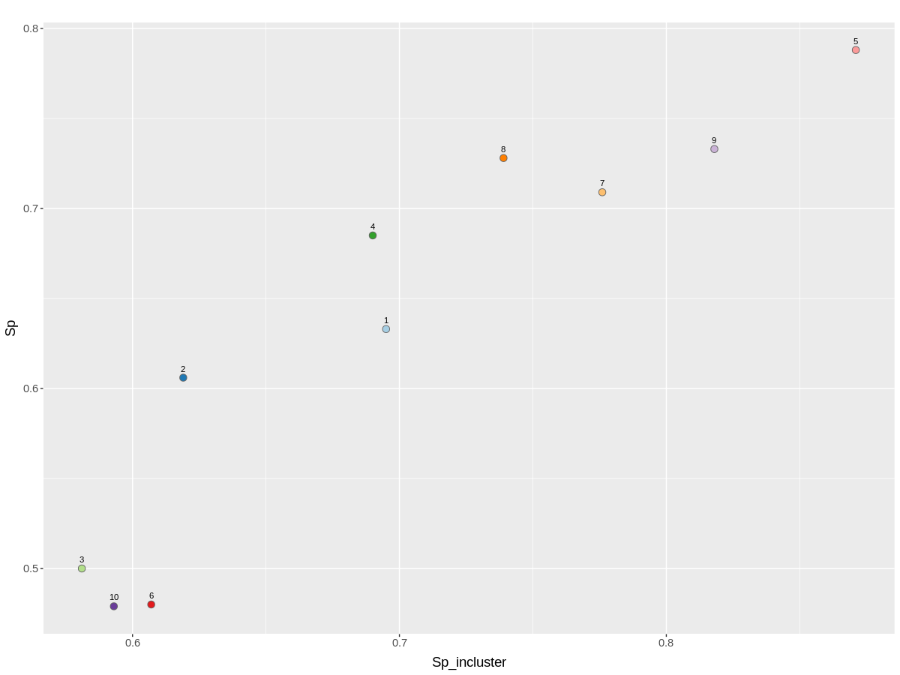

### Grafico Sp_incluster VS Percent of foreing

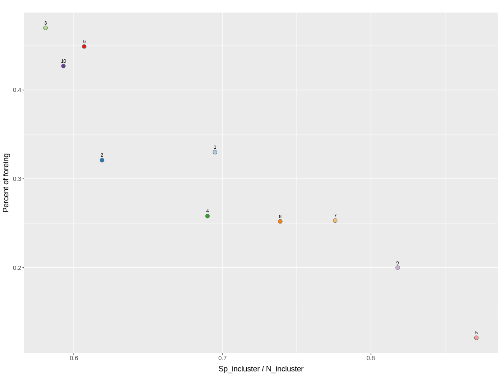

- Percent of foreing = For_x (Proporcion de extranjeros en el genotipo)
- "Sp_incluster" / "N_incluster" = Sp_incluster_x (Proporción de "Sp_incluster" en relacion a "N_incluster")
    - Sp_incluster = Numero de casos españoles en clusters de transmisión
    - N_incluster = Total de casos en clusters de transmisión

> Calculo Odds ratios

|Genotipo|Sp_incluster|For|Odds |pvalue|
|--------|------------|---|-----|------|
|1       |41          |36 |1.000|1.000 |
|2       |73          |70 |0.916|0.779 |
|3       |25          |31 |0.710|0.381 |
|4       |20          |23 |0.765|0.569 |
|5       |27          |8  |2.936|0.021 |
|6       |37          |44 |0.740|0.426 |
|7       |38          |20 |1.662|0.163 |
|8       |51          |38 |1.177|0.640 |
|9       |27          |15 |1.574|0.333 |
|10      |32          |41 |0.687|0.258 |

> Hago un calculo de "Chi-Square Test of Independence"

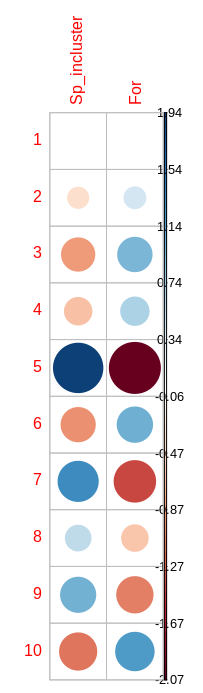
- Positive residuals are in blue. Positive values in cells specify an attraction (positive association) between the corresponding row and column variables.
- Negative residuals are in red. This implies a repulsion (negative association) between the corresponding row and column variables.

> Hago los calculos Spanish_cluster_cases VS Mixes_cluster_cases + Foreing_cluster_cases

|Genotipo  |Spanish_cluster_cases|N0_Spanish_cluster_cases|Odds |pvalue|
|----------|---------------------|------------------------|-----|------|
|1         |19                   |34                      |1.000|1.000 |
|2         |30                   |44                      |1.218|0.712 |
|3         |15                   |26                      |1.032|1.000 |
|4         |13                   |9                       |2.551|0.077 |
|5/Baps_6  |23                   |0                       |Inf  |0.000 |
|6         |4                    |21                      |0.345|0.110 |
|7         |18                   |31                      |1.039|1.000 |
|8         |35                   |27                      |2.302|0.039 |
|9/Baps11  |17                   |8                       |3.734|0.014 |
|10        |15                   |18                      |1.484|0.497 |
