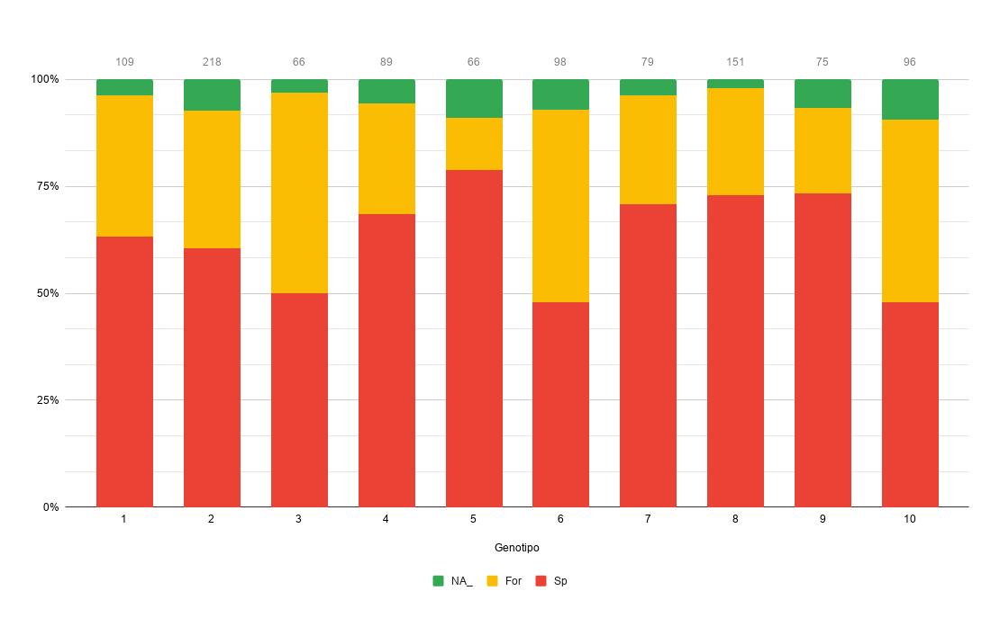
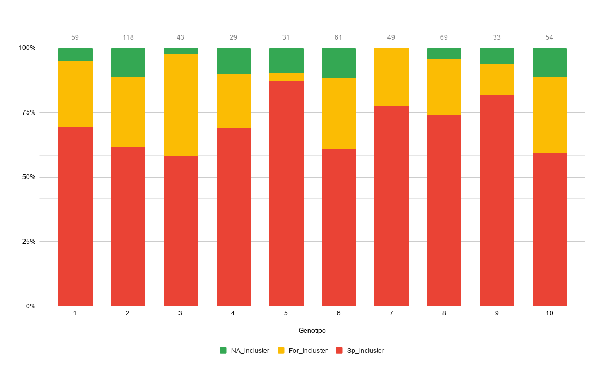
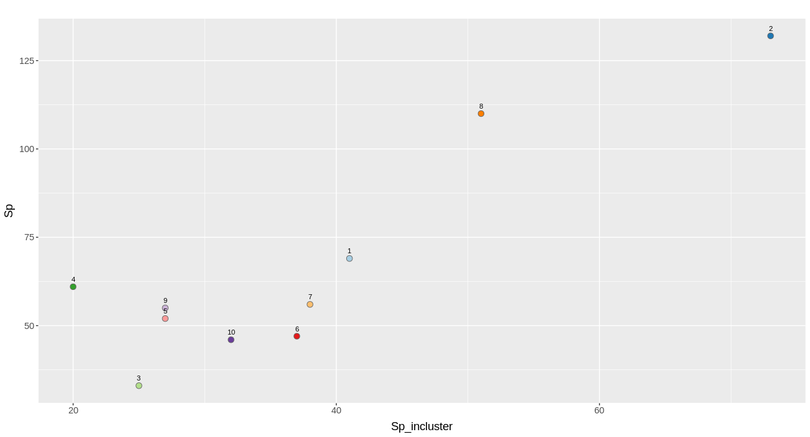
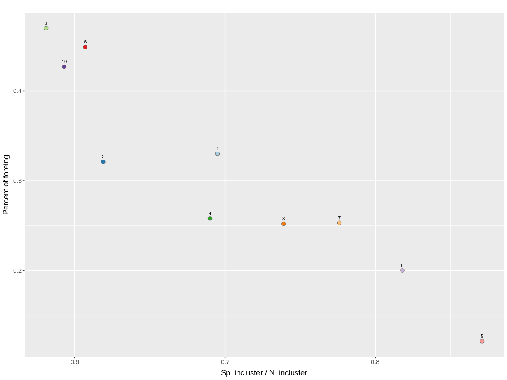

### Presentación
#### Numero de **casos españoles** por genotipo
> El genotipo 5 tiene un mayor porcentaje de casos españoles (> 75%)

#### Numero de casos **españoles en clusters** por genotipo
>  Los genotipos 5,7,9 tienen un mayor porcentaje de casos españoles en cluster (> 75%)

#### Grafico, casos españoles por genotipo VS casos españoles en clusters por genotipo

### Repito lo planteado en el trabajo de Irving
> Grafico Sp_incluster VS Percent of foreing. Los genotipos 5 y 9 presentan mayor transmisión entre españoles y menor cantidad de casos extranjeros?

- Percent of foreing = For_x (Proporción de extranjeros en el genotipo)
- "Sp_incluster" / "N_incluster" = Sp_incluster_x (Proporción de "Sp_incluster" en relacion a "N_incluster")
    - Sp_incluster = Numero de casos españoles en clusters de transmisión
    - N_incluster = Total de casos en clusters de transmisión

> Hago un calculo de "Chi-Square Test of Independence"

~~~
Pearson's Chi-squared test

data:  Tabla_Odds_Sp_incluster_For
X-squared = 21.366, df = 9, p-value = 0.01112
~~~

- Busco asociación entre españoles en cluster (Sp_incluster) y genotipos.
- Busco asociación entre casos extranjeros y genotipos.

> Grafico de residuales

- Positive residuals are in blue. Positive values in cells specify an attraction (positive association) between the corresponding row and column variables.
- Negative residuals are in red. This implies a repulsion (negative association) between the corresponding row and column variables.
- For a given cell, the size of the circle is proportional to the amount of the cell contribution.

> Calculo Odds ratios de las variables en el grafico

|Genotipo|Sp_incluster|Foreing|Odds |pvalue|
|--------|------------|-------|-----|------|
|1       |41          |36 |1.000|1.000 |
|2       |73          |70 |0.916|0.779 |
|3       |25          |31 |0.710|0.381 |
|4       |20          |23 |0.765|0.569 |
|**5**     |27        |8  |**2.936**|**0.021** |
|6       |37          |44 |0.740|0.426 |
|7       |38          |20 |1.662|0.163 |
|8       |51          |38 |1.177|0.640 |
|9       |27          |15 |1.574|0.333 |
|10      |32          |41 |0.687|0.258 |

> Repito lo propuesto por Irving, hago los calculos Spanish_cluster_cases VS N0_Spanish_cluster_cases (Mixes_cluster_cases + Foreing_cluster_cases)

|Genotipo  |Spanish_cluster_cases|N0_Spanish_cluster_cases|Odds |pvalue|
|----------|---------------------|------------------------|-----|------|
|1         |19                   |34                      |1.000|1.000 |
|2         |30                   |44                      |1.218|0.712 |
|3         |15                   |26                      |1.032|1.000 |
|4         |13                   |9                       |2.551|0.077 |
|**5/Baps_6**  |23                   |0                       |**Inf**  |**0.000** |
|6         |4                    |21                      |0.345|0.110 |
|7         |18                   |31                      |1.039|1.000 |
|**8/Baps9**   |35                   |27                      |**2.302**|**0.039** |
|**9/Baps11**  |17                   |8                       |**3.734**|**0.014** |
|10        |15                   |18                      |1.484|0.497 |
