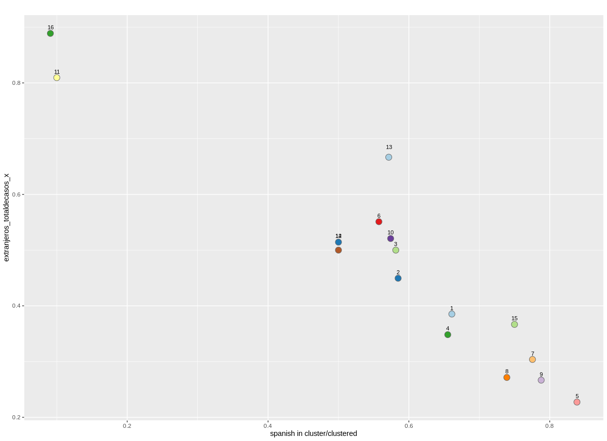
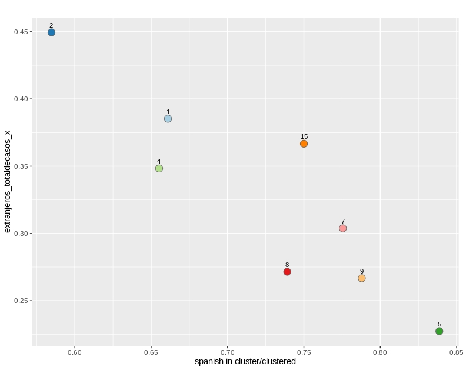
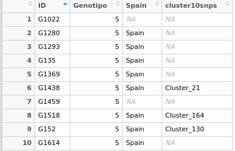
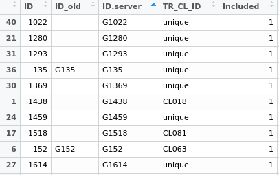

## Baps Valencia (R, iqtree)
- El programa utilizado es **Fastbaps** el cual parte de un alineamiento previamente obtenido por el pipeline.
- El alineamiento usado en este caso sera un alineamiento 1177 de linaje cuatro de genomas de pacientes de TB el mismo se utilizo para crear un filogenia con **iqtree**

### Generando tabla de Genotipos con Fastbaps (R)
input: **run_alignment_no_resis_1177.fas**

Utilizamos el scrip llamado **"Proyecto"**
~~~R
#Libraries
library(fastbaps)
library(ape)
#Nota el archivo original para los arboles es "multi" (Ver README.md)

#Loading data OK
fasta.file.name <- "run_alignment_no_resis_1177.fas"
sparse.data <- import_fasta_sparse_nt(fasta.file.name)

#Detalle OK
sparse.data <- optimise_prior(sparse.data, type = "baps")

#Running fastbaps "baps.hc" es el archivo a obtener.
baps.hc <- fast_baps(sparse.data)

#Bayesian hierarchical partition
Fastbaps <- multi_res_baps(sparse.data, levels = 6)
~~~
Resultados
~~~R
> head(Fastbaps)
  Isolates Level 1 Level 2 Level 3 Level 4 Level 5 Level 6
1      G01       1       3       7      24      67     115
2      G02       1       3       7      22      60     108
3      G03       1       2       4      12      30      49
4      G04       2       7      24      79     173     253
5    G1000       1       2       6      21      57     102
6    G1002       2       6      18      57     138     212
~~~

### Generacion de arbol filogenetico (ITOL)
input: **run_alignment_no_resis_1177.fas.treefile**

input: **Fastbapslvl2** (Archivo Itol)

> No explico el proceso solo es crear un archivo ITOL

output: https://itol.embl.de/tree/16111121936428041608308653

### Generacion de tablas (R)
Extraemos las columnas: ID y Level 2

input: **Fastbaps**

input: **Tabla: ID_Genotipo_Spain_Cluster**

~~~R
> head(Fastbaps_lvl2)
     ID Genotipo
1 G1019        1
2 G1061        1
3  G110        1
4 G1113        1
5  G111        1
6 G1154        1
~~~

~~~R
## Realizar tablas de valores de Rhierbaps & Baps
## Libreria
library(dplyr)

# Data cambiamos variables valor de X dependiendo lo que quiero obtener
x <- Fastbaps_lvl2
y <- Fastbaps_lvl2$Genotipo

# Obtenemos tabla de frecuencias
#cbind( Freq=table(x), Cumul=cumsum(table(x)), relative=prop.table(table(x)))
Freq <- cbind( Freq=table(y))

# Realizamos merge de Frecuencias con españoles
ID_Genotipo_Spain <- merge (x, Spain, by = "ID", all.x=TRUE)
Genotipo_Spain <- ID_Genotipo_Spain [c(2,3)]

# Obtenemos numero de españoles por genotipo
Freq_spain <- table(Genotipo_Spain)
Freq_spain <- as.data.frame.matrix (Freq_spain)

# Juntamos frecuencias
Frecuencias <- cbind.data.frame (Genotipo = c(1:16), Freq, Freq_spain, NoSpain = c(Freq-Freq_spain))
Frecuencias <- cbind(Frecuencias, Spain_porcen = c(((Frecuencias$Spain)*1) / (Frecuencias$Freq)))

# Frecuencia total de Genotipos en transmicion (cluster)
ID_Genotipo_Spain_Cluster <- merge (ID_Genotipo_Spain, Clusters_10snps, by = "ID", all.x=TRUE)

# Transmicion total
Genotipo_Cluster <- ID_Genotipo_Spain_Cluster [c(2,4)]
Genotipo_Cluster <- cbind(Genotipo_Cluster, In_cluster = c(Genotipo_Cluster$cluster10snps==TRUE))
Genotipo_incluster <- Genotipo_Cluster [c(1,3)]
Genotipo_incluster_allfreq <- cbind.data.frame( Freq=table(Genotipo_incluster))
names(Genotipo_incluster_allfreq) = c("Genotipo", "x", "Transmicion")

Spain_Genotipo_incluster <- filter(ID_Genotipo_Spain_Cluster, Spain == "Spain")
Spain_Genotipo_incluster <- Spain_Genotipo_incluster[!is.na(Spain_Genotipo_incluster$cluster10snps),]
Spain_Genotipo_incluster <- cbind(Spain_Genotipo_incluster, In_cluster = c(Spain_Genotipo_incluster$cluster10snps==TRUE))
Spain_Genotipo_incluster <- Spain_Genotipo_incluster [c(2,5)]
Spain_Genotipo_incluster <- cbind( Freq=table(Spain_Genotipo_incluster$Genotipo))

# Renombramos columnas y agregamos Españoles en cluster y en no cluster
Frecuencias <- cbind.data.frame(Frecuencias, Spain_incluster = Spain_Genotipo_incluster)
names(Frecuencias) = c("Genotipo", "N", "Spain", "No_spain", "Spain_x", "Spain_incluster" )
Frecuencias <- cbind(Frecuencias, Spain_nocluster = c(Frecuencias$Spain - Frecuencias$Spain_incluster))
Frecuencias <- cbind(Frecuencias, Spain_incluster_x = c(((Frecuencias$Spain_incluster)*1) / (Frecuencias$Spain)))

# Agregamos transmicion
Frecuencias <- cbind(Frecuencias, Total_incluster = Genotipo_incluster_allfreq$Transmicion)
Frecuencias <- cbind(Frecuencias, Spain_incluster_xx = c(((Frecuencias$Spain_incluster)*1) / (Frecuencias$Total_incluster)))

# Adecuamos columnas
names(Frecuencias) = c("Genotipo","N","Sp","No_sp","Sp_x","Sp_incluster","Sp_nocluster","Sp_incluster_x","N_incluster","N_sp_incluster_x")

#Agregamos foreing
Frecuencias <- cbind(Frecuencias, Foreing_incluster = c(((Frecuencias$N_incluster)) - (Frecuencias$Sp_incluster)))
Frecuencias <- cbind(Frecuencias, Foreing_incluster_x = c(((Frecuencias$Foreing_incluster)*1) / (Frecuencias$N_incluster)))

#Redondeamos
Frecuencias <- round (Frecuencias, 4)

# Creamso csvs
write.csv(Frecuencias, "Frecuencias")
write.csv(ID_Genotipo_Spain_Cluster, "ID_Genotipo_Spain_Cluster")

# Borramos archivos intermedios
rm (x, y, Freq, Freq_spain, ID_Genotipo_Spain, Genotipo_Spain, Spain_Genotipo_incluster, Genotipo_incluster, Genotipo_Cluster, Genotipo_incluster_allfreq)

~~~

output: **Tabla: Frecuencias**

|Genotipo|N  |Sp |No_sp|Sp_x  |Sp_incluster|Sp_nocluster|Sp_incluster_x|N_incluster|N_sp_incluster_x|Foreing_incluster|Foreing_incluster_x|extranjeros_totaldecasos_x|
|--------|---|---|-----|------|------------|------------|--------------|-----------|----------------|-----------------|-------------------|--------------------------|
|1       |109|67 |42   |0.6147|39          |28          |0.5821        |59         |0.661           |20               |0.339              |0.3853                    |
|2       |218|120|98   |0.5505|69          |51          |0.575         |118        |0.5847          |49               |0.4153             |0.4495                    |
|3       |66 |33 |33   |0.5   |25          |8           |0.7576        |43         |0.5814          |18               |0.4186             |0.5                       |
|4       |89 |58 |31   |0.6517|19          |39          |0.3276        |29         |0.6552          |10               |0.3448             |0.3483                    |
|5       |66 |51 |15   |0.7727|26          |25          |0.5098        |31         |0.8387          |5                |0.1613             |0.2273                    |
|6       |98 |44 |54   |0.449 |34          |10          |0.7727        |61         |0.5574          |27               |0.4426             |0.551                     |
|7       |79 |55 |24   |0.6962|38          |17          |0.6909        |49         |0.7755          |11               |0.2245             |0.3038                    |
|8       |151|110|41   |0.7285|51          |59          |0.4636        |69         |0.7391          |18               |0.2609             |0.2715                    |
|9       |75 |55 |20   |0.7333|26          |29          |0.4727        |33         |0.7879          |7                |0.2121             |0.2667                    |
|10      |96 |46 |50   |0.4792|31          |15          |0.6739        |54         |0.5741          |23               |0.4259             |0.5208                    |
|11      |21 |4  |17   |0.1905|1           |3           |0.25          |10         |0.1             |9                |0.9                |0.8095                    |
|12      |2  |1  |1    |0.5   |1           |0           |1             |2          |0.5             |1                |0.5                |0.5                       |
|13      |15 |5  |10   |0.3333|4           |1           |0.8           |7          |0.5714          |3                |0.4286             |0.6667                    |
|14      |35 |17 |18   |0.4857|8           |9           |0.4706        |16         |0.5             |8                |0.5                |0.5143                    |
|15      |30 |19 |11   |0.6333|6           |13          |0.3158        |8          |0.75            |2                |0.25               |0.3667                    |
|16      |27 |3  |24   |0.1111|1           |2           |0.3333        |11         |0.0909          |10               |0.9091             |0.8889                    |


### Generacion de graficos (R)
> Los graficos explican que se esta graficando. Sp_incluster vs. extranjeros/totaldecasos, es decir "Los casos españoles en clusters españoles" vs "Los casos extranjeros sobre el total de casos"

```R
#Plots
library(ggplot2)
library(ggpubr)

## Grafico de españoles en cluster/casos vs extranjeros / total de casos en el genotipo
ggplot(Frecuencias, aes(x=N_sp_incluster_x, y=extranjeros_totaldecasos_x, label = rownames(Frecuencias), group = Genotipo)) +
    geom_point(shape = 21, size = 4, color = "gray40", fill = c("#a6cee3","#1f78b4","#b2df8a","#33a02c","#fb9a99","#e31a1c","#fdbf6f","#ff7f00","#cab2d6","#6a3d9a","#ffff99","#b15928","#a6cee3","#1f78b4","#b2df8a","#33a02c")) +
    ylab("extranjeros_totaldecasos_x") + xlab("spanish in cluster/clustered") +
    ggtitle("") +
    theme(plot.title=element_text(hjust = 0.5, size = 12)) +
    geom_text(vjust = c(-1,-1,-1,-1,-1,-1,-1,-1,-1,-1,-1,-3,-2,-1,-1,-1), hjust = c(0.5,0.5,0.5,0.5,0.5,0.5,0.5,0.5,0.5,0.5,0.5,0.5,0.5,0.5,0.5,0.5), size = 3)
  theme(axis.text=element_text(size=11),axis.title.x = element_text (size=14, margin = margin(t = 8, r = 0, b = 0, l = 0)),axis.title.y = element_text(size=14, margin = margin(t = 0, r = 5, b = 0, l = 0 )))

##  Subset: Grafico de españoles en cluster/casos vs extranjeros / total de casos en el genotipo
ggplot(N_mayor_20_Sp_x_mayor_0.5, aes(x=N_sp_incluster_x, y=extranjeros_totaldecasos_x, label = rownames(N_mayor_20_Sp_x_mayor_0.5), group = Genotipo)) +
    geom_point(shape = 21, size = 4, color = "gray40", fill = c("#a6cee3","#1f78b4","#b2df8a","#33a02c","#fb9a99","#e31a1c", "#fdbf6f","#ff7f00")) +
    ylab("extranjeros_totaldecasos_x") + xlab("spanish in cluster/clustered") +
    ggtitle("") +
    theme(plot.title=element_text(hjust = 0.5, size = 12)) +
    geom_text(vjust = c(-1,-1,-1,-1,-1,-1,-1,-1), hjust = c(0.5,0.5,0.5,0.5,0.5,0.5,0.5,0.5), size = 3)
  theme(axis.text=element_text(size=11),axis.title.x = element_text (size=14, margin = margin(t = 8, r = 0, b = 0, l = 0)),axis.title.y = element_text(size=14, margin = margin(t = 0, r = 5, b = 0, l = 0 )))
```

Resultado: Se grafica





**x = Ratio de españoles en cluster**

**y = Ratio extranjeros/totaldecasos_x**

### Comparacion de Genotipos
Comparamos contra los genotipos obtenidos por Irving y observamos que contienen las mismas muestras.

Genotipo5 Carlos


BAPS6 Irving


### Calculos de ORs
input: **Tabla Frecuencias**

Generamos un Subset para tener claro el calculo del p-valor.

|FIELD1      |Genotipo                          |N_incluster   |N                             |Sp_incluster|Spanish_cluster_cases|NClustercasesSpanishclustercases|
|------------|----------------------------------|--------------|------------------------------|------------|---------------------|--------------------------------|
|1           |1                                 |59            |109                           |39          |7                    |52                              |
|2           |2                                 |118           |218                           |69          |25                   |93                              |
|4           |4                                 |29            |89                            |19          |10                   |19                              |
|5           |5                                 |31            |66                            |26          |15                   |16                              |
|7           |7                                 |49            |79                            |38          |18                   |31                              |
|8           |8                                 |69            |151                           |51          |35                   |34                              |
|9           |9                                 |33            |75                            |26          |12                   |21                              |
|15          |15                                |8             |30                            |6           |2                    |6

Contruimos una matriz general:

|FIELD1      |Spanish_cluster_cases             |NClustercasesSpanishclustercases|
|------------|----------------------------------|--------------------------------|
|Baps_01     |7                                 |52                              |
|Baps_02     |25                                |93                              |
|Baps_04     |10                                |19                              |
|Baps_05     |15                                |16                              |
|Baps_07     |18                                |31                              |
|Baps_08     |35                                |34                              |
|Baps_09     |12                                |21                              |
|Baps_15     |2                                 |6                               |

Contruimos tablas de 2x2:
```R
# Veamos para elegir las filas de la matrix hacemos asi: [c(Genotipo, Genotipo de referencia),]
Gen_RefGen <- matrix_genotipos[c(1,2),]

```
|FIELD1      |Spanish_cluster_cases             |NClustercasesSpanishclustercases|
|------------|----------------------------------|--------------------------------|
|Baps_01     |7                                 |52                              |
|Baps_02     |25                                |93                              |


Realizamos el calculo del p-valor mediante una prueba de fisher de dos y una cola. Apuntamos los resultados y generamos tablas. Tome como refecnia los Baps 02/15

```R
fisher.test(Gen_RefGen)
fisher.test(Gen_RefGen, alternative = "greater")
```
##### Transmission_in_Spanish_ref1

|Genotipo|N_incluster|N  |Sp_incluster|Spanish_cluster_cases|NClustercasesSpanishclustercases|pvalue_two_sided|pvalue_one_sided|Baps_Irvin|
|--------|-----------|---|------------|---------------------|--------------------------------|----------------|----------------|----------|
|1       |59         |109|39          |7                    |52                              |reference       |reference       |BAPS_03   |
|2       |118        |218|69          |25                   |93                              |0.1505          |0.0925          |BAPS_03   |
|4       |29         |89 |19          |10                   |19                              |0.01981         |0.01417         |BAPS_07/08|
|5       |31         |66 |26          |15                   |16                              |0.0002373       |0.0002205       |BAPS_06   |
|7       |49         |79 |38          |18                   |31                              |0.002881        |0.002288        |BAPS_07   |
|8       |69         |151|51          |35                   |34                              |3.598e-06       |1.922e-06       |BAPS_09   |
|9       |33         |75 |26          |12                   |21                              |0.007618        |0.006622        |BAPS_11   |
|15      |8          |30 |6           |2                    |6                               |0.2912          |0.2912          |BAPS_02   |


##### Transmission_in_Spanish_ref2
|FIELD1      |Genotipo                          |N_incluster   |N  |Sp_incluster|Spanish_cluster_cases|NClustercasesSpanishclustercases|pvalue_two_sided|pvalue_one_sided|
|------------|----------------------------------|--------------|---|------------|---------------------|--------------------------------|----------------|----------------|
|1           |1                                 |59            |109|39          |7                    |52                              |0.1505          |0.9613          |
|2           |2                                 |118           |218|69          |25                   |93                              |reference       |reference       |
|4           |4                                 |29            |89 |19          |10                   |19                              |0.148           |0.1054          |
|5           |5                                 |31            |66 |26          |15                   |16                              |0.005309        |0.003248        |
|7           |7                                 |49            |79 |38          |18                   |31                              |0.05113         |0.03055         |
|8           |8                                 |69            |151|51          |35                   |34                              |0.00004389      |0.00003384      |
|9           |9                                 |33            |75 |26          |12                   |21                              |0.1071          |0.06191         |
|15          |15                                |8             |30 |6           |2                    |6                               |0.68            |0.5436          |

##### Transmission_in_Spanish_ref15
|FIELD1      |Genotipo                          |N_incluster   |N  |Sp_incluster|Spanish_cluster_cases|NClustercasesSpanishclustercases|pvalue_two_sided|pvalue_one_sided|
|------------|----------------------------------|--------------|---|------------|---------------------|--------------------------------|----------------|----------------|
|1           |1                                 |59            |109|39          |7                    |52                              |0.2912          |0.9322          |
|2           |2                                 |118           |218|69          |25                   |93                              |0.68            |0.7695          |
|4           |4                                 |29            |89 |19          |10                   |19                              |1               |0.4802          |
|5           |5                                 |31            |66 |26          |15                   |16                              |0.426           |0.2173          |
|7           |7                                 |49            |79 |38          |18                   |31                              |0.6993          |0.4153          |
|8           |8                                 |69            |151|51          |35                   |34                              |0.2655          |0.1579          |
|9           |9                                 |33            |75 |26          |12                   |21                              |0.6925          |0.4353          |
|15          |15                                |8             |30 |6           |2                    |6                               |reference       |reference       |

Conclusiones : Hay un favoritismo por parte de algunos genotipos a enconytrarse en transmicion dentro de clusters españoles.

output: **Transmission_in_Spanish_ref2 & Transmission_in_Spanish_ref15**

### Tablas de cluster
Obtuve estos datos de forma manual **ver genotipo 8**

|FIELD1      |Genotipo                          |N_incluster   |N  |Sp_incluster|Spanish_cluster_cases|Spanish_clusters2.0|Mixed_clusters|Total_clusters|
|------------|----------------------------------|--------------|---|------------|---------------------|-------------------|--------------|--------------|
|1           |1                                 |59            |109|39          |7                    |2                  |12            |14            |
|2           |2                                 |118           |218|69          |25                   |8                  |19            |27            |
|4           |4                                 |29            |89 |19          |10                   |3                  |6             |9             |
|5           |5                                 |31            |66 |26          |15                   |4                  |3             |7             |
|7           |7                                 |49            |79 |38          |18                   |4                  |7             |11            |
|8           |8                                 |69            |151|51          |35                   |14                 |6             |20            |
|9           |9                                 |33            |75 |26          |12                   |4                  |5             |9             |
|15          |15                                |8             |30 |6           |2                    |1                  |2             |3             |

### Equivalencia de genotipos Baps Carlos con Baps Irving


### Perspectivas y conclusiones
