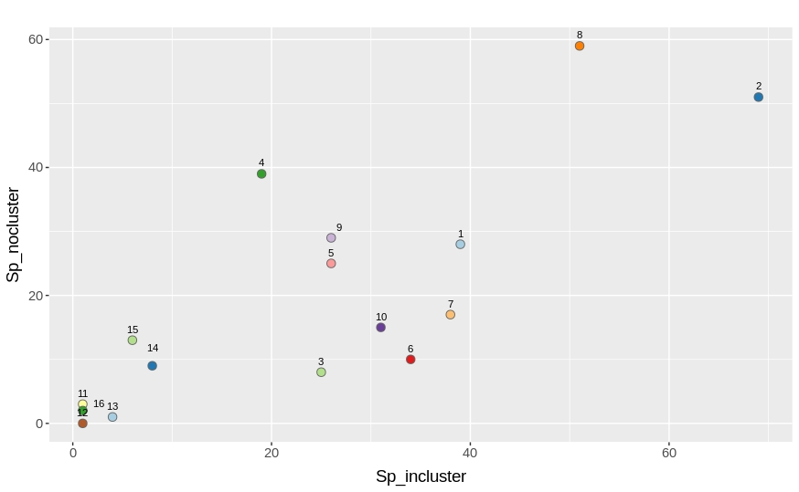
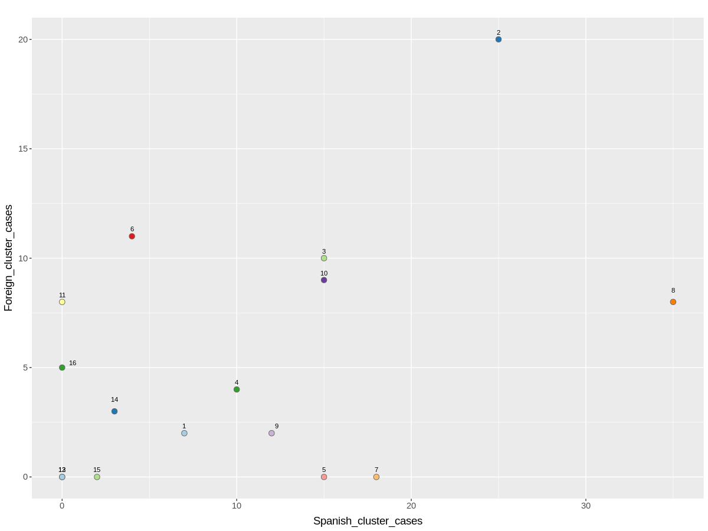
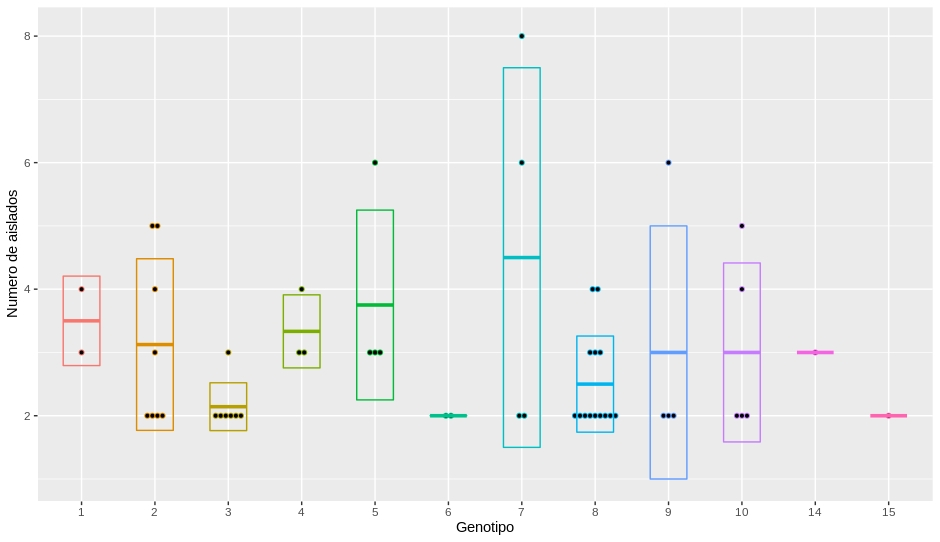

## Baps Valencia
- El proyecto tiene como objetivo identificar genotipos que se encuentren en transmición dentro de la poblacion española.
- El programa utilizado para la identificacion de los genotipos es **Fastbaps** el cual toma como "input" un alineamiento previamente obtenido ".fas".
- El alineamiento usado en este caso sera un alineamiento de 1177 aislados de linaje cuatro de genomas de pacientes de TB.

### Generando tabla de Genotipos con Fastbaps (R)
input: **run_alignment_no_resis_1177.fas**

Generamos y utilizamos el scrip llamado **"Proyecto"** donde detallamos los parametros previamente elegidos para correr el Baps
~~~r
#Libraries
library(fastbaps)
library(ape)
#Nota el archivo original para los arboles es "multi" (Ver README.md)

#Loading data OK
fasta.file.name <- "run_alignment_no_resis_1177.fas"
sparse.data <- import_fasta_sparse_nt(fasta.file.name)

#Detalle OK
sparse.data <- optimise_prior(sparse.data, type = "baps")

#Running fastbaps "baps.hc" es el archivo a obtener.
baps.hc <- fast_baps(sparse.data)

#Bayesian hierarchical partition
Fastbaps <- multi_res_baps(sparse.data, levels = 6)
~~~
output: obtenemos una tabla con los genotipos a varios niveles, de la cual elegimos el Level2 que esta formado por 16 genotipos.

~~~r
> head(Fastbaps)
  Isolates Level 1 Level 2 Level 3 Level 4 Level 5 Level 6
1      G01       1       3       7      24      67     115
2      G02       1       3       7      22      60     108
3      G03       1       2       4      12      30      49
4      G04       2       7      24      79     173     253
5    G1000       1       2       6      21      57     102
6    G1002       2       6      18      57     138     212
~~~

### Generacion de arbol filogenetico del lvl2 del Baps (iTOL)
input: **run_alignment_no_resis_1177.fas.treefile**

input: **Fastbapslvl2** (Archivo Itol), para graficar el lvl2 de la tabla anterior.

> No explico el proceso solo es crear un archivo iTOL

output: https://itol.embl.de/tree/16111121936428041608308653

### Generacion de tablas, Datos de la DGSP vs Genotipos Baps(R)
input: **Tabla de genotipos de Fastbaps**

input: **Tabla: ID_Genotipo_Spain_Cluster** (subset de la tabla general del proyecto de Valencia)

Asignamos las muestras a sus genotipos.
~~~r
> head(Fastbaps_lvl2)
     ID Genotipo
1 G1019        1
2 G1061        1
3  G110        1
4 G1113        1
5  G111        1
6 G1154        1
~~~

~~~r
## Realizar tablas de valores de Rhierbaps & Baps
## Libreria
library(dplyr)

# Data cambiamos variables valor de X dependiendo lo que quiero obtener
x <- Fastbaps_lvl2
y <- Fastbaps_lvl2$Genotipo

# Obtenemos tabla de frecuencias
#cbind( Freq=table(x), Cumul=cumsum(table(x)), relative=prop.table(table(x)))
Freq <- cbind( Freq=table(y))

# Realizamos merge de Frecuencias con españoles
ID_Genotipo_Spain <- merge (x, Spain, by = "ID", all.x=TRUE)
Genotipo_Spain <- ID_Genotipo_Spain [c(2,3)]

# Obtenemos numero de españoles por genotipo
Freq_spain <- table(Genotipo_Spain)
Freq_spain <- as.data.frame.matrix (Freq_spain)

# Juntamos frecuencias
Frecuencias <- cbind.data.frame (Genotipo = c(1:16), Freq, Freq_spain, NoSpain = c(Freq-Freq_spain))
Frecuencias <- cbind(Frecuencias, Spain_porcen = c(((Frecuencias$Spain)*1) / (Frecuencias$Freq)))

# Frecuencia total de Genotipos en transmicion (cluster)
ID_Genotipo_Spain_Cluster <- merge (ID_Genotipo_Spain, Clusters_10snps, by = "ID", all.x=TRUE)

# Transmicion total
Genotipo_Cluster <- ID_Genotipo_Spain_Cluster [c(2,4)]
Genotipo_Cluster <- cbind(Genotipo_Cluster, In_cluster = c(Genotipo_Cluster$cluster10snps==TRUE))
Genotipo_incluster <- Genotipo_Cluster [c(1,3)]
Genotipo_incluster_allfreq <- cbind.data.frame( Freq=table(Genotipo_incluster))
names(Genotipo_incluster_allfreq) = c("Genotipo", "x", "Transmicion")

Spain_Genotipo_incluster <- filter(ID_Genotipo_Spain_Cluster, Spain == "Spain")
Spain_Genotipo_incluster <- Spain_Genotipo_incluster[!is.na(Spain_Genotipo_incluster$cluster10snps),]
Spain_Genotipo_incluster <- cbind(Spain_Genotipo_incluster, In_cluster = c(Spain_Genotipo_incluster$cluster10snps==TRUE))
Spain_Genotipo_incluster <- Spain_Genotipo_incluster [c(2,5)]
Spain_Genotipo_incluster <- cbind( Freq=table(Spain_Genotipo_incluster$Genotipo))

# Renombramos columnas y agregamos Españoles en cluster y en no cluster
Frecuencias <- cbind.data.frame(Frecuencias, Spain_incluster = Spain_Genotipo_incluster)
names(Frecuencias) = c("Genotipo", "N", "Spain", "No_spain", "Spain_x", "Spain_incluster" )
Frecuencias <- cbind(Frecuencias, Spain_nocluster = c(Frecuencias$Spain - Frecuencias$Spain_incluster))
Frecuencias <- cbind(Frecuencias, Spain_incluster_x = c(((Frecuencias$Spain_incluster)*1) / (Frecuencias$Spain)))

# Agregamos transmicion
Frecuencias <- cbind(Frecuencias, Total_incluster = Genotipo_incluster_allfreq$Transmicion)
Frecuencias <- cbind(Frecuencias, Spain_incluster_xx = c(((Frecuencias$Spain_incluster)*1) / (Frecuencias$Total_incluster)))

# Adecuamos columnas
names(Frecuencias) = c("Genotipo","N","Sp","No_sp","Sp_x","Sp_incluster","Sp_nocluster","Sp_incluster_x","N_incluster","N_sp_incluster_x")

#Agregamos foreing
Frecuencias <- cbind(Frecuencias, Foreing_incluster = c(((Frecuencias$N_incluster)) - (Frecuencias$Sp_incluster)))
Frecuencias <- cbind(Frecuencias, Foreing_incluster_x = c(((Frecuencias$Foreing_incluster)*1) / (Frecuencias$N_incluster)))

#Redondeamos
Frecuencias <- round (Frecuencias, 4)

# Creamso csvs
write.csv(Frecuencias, "Frecuencias")
write.csv(ID_Genotipo_Spain_Cluster, "ID_Genotipo_Spain_Cluster")

# Borramos archivos intermedios
rm (x, y, Freq, Freq_spain, ID_Genotipo_Spain, Genotipo_Spain, Spain_Genotipo_incluster, Genotipo_incluster, Genotipo_Cluster, Genotipo_incluster_allfreq)

~~~

output: **Tabla de frecuencias de los 16 genotipos del baps**

|Genotipo|N  |Sp |No_sp|Sp_x  |Sp_incluster|Sp_nocluster|Sp_incluster_x|N_incluster|N_sp_incluster_x|Foreing_incluster|Foreing_incluster_x|extranjeros_totaldecasos_x|
|--------|---|---|-----|------|------------|------------|--------------|-----------|----------------|-----------------|-------------------|--------------------------|
|1       |109|67 |42   |0.6147|39          |28          |0.5821        |59         |0.661           |20               |0.339              |0.3853                    |
|2       |218|120|98   |0.5505|69          |51          |0.575         |118        |0.5847          |49               |0.4153             |0.4495                    |
|3       |66 |33 |33   |0.5   |25          |8           |0.7576        |43         |0.5814          |18               |0.4186             |0.5                       |
|4       |89 |58 |31   |0.6517|19          |39          |0.3276        |29         |0.6552          |10               |0.3448             |0.3483                    |
|5       |66 |51 |15   |0.7727|26          |25          |0.5098        |31         |0.8387          |5                |0.1613             |0.2273                    |
|6       |98 |44 |54   |0.449 |34          |10          |0.7727        |61         |0.5574          |27               |0.4426             |0.551                     |
|7       |79 |55 |24   |0.6962|38          |17          |0.6909        |49         |0.7755          |11               |0.2245             |0.3038                    |
|8       |151|110|41   |0.7285|51          |59          |0.4636        |69         |0.7391          |18               |0.2609             |0.2715                    |
|9       |75 |55 |20   |0.7333|26          |29          |0.4727        |33         |0.7879          |7                |0.2121             |0.2667                    |
|10      |96 |46 |50   |0.4792|31          |15          |0.6739        |54         |0.5741          |23               |0.4259             |0.5208                    |
|11      |21 |4  |17   |0.1905|1           |3           |0.25          |10         |0.1             |9                |0.9                |0.8095                    |
|12      |2  |1  |1    |0.5   |1           |0           |1             |2          |0.5             |1                |0.5                |0.5                       |
|13      |15 |5  |10   |0.3333|4           |1           |0.8           |7          |0.5714          |3                |0.4286             |0.6667                    |
|14      |35 |17 |18   |0.4857|8           |9           |0.4706        |16         |0.5             |8                |0.5                |0.5143                    |
|15      |30 |19 |11   |0.6333|6           |13          |0.3158        |8          |0.75            |2                |0.25               |0.3667                    |
|16      |27 |3  |24   |0.1111|1           |2           |0.3333        |11         |0.0909          |10               |0.9091             |0.8889                    |

- **Genotipo** = Genotipo
- **N** = Total de aislados
- **Sp** = Total de aislados españoles
- **No_sp** = Total de aislados NO españoles
- **Sp_x** = Proporcion de españoles en el genotipo
- **Sp_incluster** =  Numero de españoles en clusters de transmicion
- **Sp_nocluster** =  Numero de españoles que no se encuentran en clusters de transmición
- **Sp_incluster_x** = Proporcion de **"Sp_incluster"** en relacion a **"Sp"**
- **N_incluster** = Total de aislados en clusters de transmición
- **N_sp_incluster_x** = Proporcion de **"Sp_incluster"** en relacion a **"N_incluster"**
- **Foreing_incluster** = Numero de NO españoles en clusters de transmición
- **Foreing_incluster_x** = Proporcion de **"Foreing_incluster"** en relacion a **"N_incluster"**
- **extranjeros_totaldecasos_x** = Proporcion de **"No_sp"** en relacion a **"N"**

### Generacion de graficos (R)
Se grafica:
- **N_sp_incluster_x** (x) = Proporcion de "Sp_incluster" en relacion a "N_incluster"
- **extranjeros_totaldecasos_x** (y) = Proporcion de "No_sp" en relacion a "N"

|Genotipo|N_sp_incluster_x|extranjeros_totaldecasos_x|
|--------|----------------|--------------------------|
|1       |0.6610          |0.3853                    |
|2       |0.5847          |0.4495                    |
|3       |0.5814          |0.5000                    |
|4       |0.6552          |0.3483                    |
|5       |0.8387          |0.2273                    |
|6       |0.5574          |0.5510                    |
|7       |0.7755          |0.3038                    |
|8       |0.7391          |0.2715                    |
|9       |0.7879          |0.2667                    |
|10      |0.5741          |0.5208                    |
|11      |0.1000          |0.8095                    |
|12      |0.5000          |0.5000                    |
|13      |0.5714          |0.6667                    |
|14      |0.5000          |0.5143                    |
|15      |0.7500          |0.3667                    |
|16      |0.0909          |0.8889                    |

```r
#Plots
library(ggplot2)
library(ggpubr)

## Grafico de españoles en cluster/casos vs extranjeros / total de casos en el genotipo
ggplot(Frecuencias, aes(x=N_sp_incluster_x, y=extranjeros_totaldecasos_x, label = rownames(Frecuencias), group = Genotipo)) +
    geom_point(shape = 21, size = 4, color = "gray40", fill = c("#a6cee3","#1f78b4","#b2df8a","#33a02c","#fb9a99","#e31a1c","#fdbf6f","#ff7f00","#cab2d6","#6a3d9a","#ffff99","#b15928","#a6cee3","#1f78b4","#b2df8a","#33a02c")) +
    ylab("extranjeros_totaldecasos_x") + xlab("spanish in cluster/clustered") +
    ggtitle("") +
    theme(plot.title=element_text(hjust = 0.5, size = 12)) +
    geom_text(vjust = c(-1,-1,-1,-1,-1,-1,-1,-1,-1,-1,-1,-3,-2,-1,-1,-1), hjust = c(0.5,0.5,0.5,0.5,0.5,0.5,0.5,0.5,0.5,0.5,0.5,0.5,0.5,0.5,0.5,0.5), size = 3)
  theme(axis.text=element_text(size=11),axis.title.x = element_text (size=14, margin = margin(t = 8, r = 0, b = 0, l = 0)),axis.title.y = element_text(size=14, margin = margin(t = 0, r = 5, b = 0, l = 0 )))

##  Subset: Grafico de españoles en cluster/casos vs extranjeros / total de casos en el genotipo
ggplot(N_mayor_20_Sp_x_mayor_0.5, aes(x=N_sp_incluster_x, y=extranjeros_totaldecasos_x, label = rownames(N_mayor_20_Sp_x_mayor_0.5), group = Genotipo)) +
    geom_point(shape = 21, size = 4, color = "gray40", fill = c("#a6cee3","#1f78b4","#b2df8a","#33a02c","#fb9a99","#e31a1c", "#fdbf6f","#ff7f00")) +
    ylab("extranjeros_totaldecasos_x") + xlab("spanish in cluster/clustered") +
    ggtitle("") +
    theme(plot.title=element_text(hjust = 0.5, size = 12)) +
    geom_text(vjust = c(-1,-1,-1,-1,-1,-1,-1,-1), hjust = c(0.5,0.5,0.5,0.5,0.5,0.5,0.5,0.5), size = 3)
  theme(axis.text=element_text(size=11),axis.title.x = element_text (size=14, margin = margin(t = 8, r = 0, b = 0, l = 0)),axis.title.y = element_text(size=14, margin = margin(t = 0, r = 5, b = 0, l = 0 )))
```
output:


### Calculos de ORs
input: **Tabla de frecuencias de los 16 genotipos del baps**

Generamos un Subset para calcular el p-valor de los 16 genotipos

|Genotipo                          |N_incluster   |N                             |Sp_incluster|Spanish_cluster_cases|N_incluster - Spanish_cluster_cases|
|----------------------------------|--------------|------------------------------|------------|---------------------|--------------------------------|
|1                                 |59            |109                           |39          |7                    |52                              |
|2                                 |118           |218                           |69          |25                   |93                              |
|4                                 |29            |89                            |19          |10                   |19                              |
|5                                 |31            |66                            |26          |15                   |16                              |
|7                                 |49            |79                            |38          |18                   |31                              |
|8                                 |69            |151                           |51          |35                   |34                              |
|9                                 |33            |75                            |26          |12                   |21                              |
|15                                |8             |30                            |6           |2                    |6

- **Genotipo** = Genotipo
- **N** = Total de aislados
- **Sp_incluster** =  Numero de españoles en clusters de transmicion
- **Spanish_cluster_cases** = Numero de españoles en clusters de solo españoles
- **N_incluster - Spanish_cluster_cases** = Numero de aislados que no pertenecen a clusters de solo españoles

Contruimos una matriz general para el calculo de OR:

|Genotipo      |Spanish_cluster_cases             |N_incluster - Spanish_cluster_cases|
|------------|----------------------------------|--------------------------------|
|Baps_01     |7                                 |52                              |
|Baps_02     |25                                |93                              |
|Baps_04     |10                                |19                              |
|Baps_05     |15                                |16                              |
|Baps_07     |18                                |31                              |
|Baps_08     |35                                |34                              |
|Baps_09     |12                                |21                              |
|Baps_15     |2                                 |6                               |

- **Genotipo** = Genotipo
- **Spanish_cluster_cases** = Numero de españoles en clusters de solo españoles
- **N_incluster - Spanish_cluster_cases** = Numero de aislados que no pertenecen a clusters de solo españoles

Contruimos tablas de 2x2 para cada operacion:
```{r}
# Veamos para elegir las filas de la matrix hacemos asi: [c(Genotipo, Genotipo de referencia),]
Gen_RefGen <- matrix_genotipos[c(1,2),]

```
|Genotipo      |Spanish_cluster_cases             |N_incluster - Spanish_cluster_cases|
|------------|----------------------------------|--------------------------------|
|Baps_01     |7                                 |52                              |
|Baps_02     |25                                |93                              |


Realizamos el calculo del p-valor mediante una prueba de fisher de dos y una cola. Apuntamos los resultados y generamos las siguientes tablas. Tome como refencia los Baps 02, aunque probamos varias opciones.

```{r}
fisher.test(Gen_RefGen)
fisher.test(Gen_RefGen, alternative = "greater")
```
##### Transmission_in_Spanish_ref2

|Genotipo|N_incluster|N  |Sp_incluster|Spanish_cluster_cases|N_incluster - Spanish_cluster_cases|Odds_ratio|confidence_interval|pvalue_two_sided|pvalue_one_sided|
|--------|-----------|---|------------|---------------------|--------------------------------|----------|---------------------|----------------|----------------|
|1       |59         |109|39          |7                    |52                              |0.5025 |0.1715 - 1.3009 |0.1505          |0.9613          |
|2       |118        |218|69          |25                   |93                              |reference |reference    |reference       |reference       |
|4       |29         |89 |19          |10                   |19                              |1.9480  |0.7147 - 5.0943|0.148           |0.1054          |
|5       |31         |66 |26          |15                   |16                              |3.4530  |1.3860 - 8.6536|0.005309        |0.003248        |
|7       |49         |79 |38          |18                   |31                              |2.1492  |0.9675 - 4.7445|0.05113         |0.03055         |
|8       |69         |151|51          |35                   |34                              |3.7990  |1.9090 - 7.6937|0.00004389      |0.00003384      |
|9       |33         |75 |26          |12                   |21                              |2.1139  |0.8299 - 5.2497|0.1071          |0.06191         |
|15      |8          |30 |6           |2                    |6                               |1.2377  |0.1154 - 7.4874|0.68            |0.5436          |

- **Genotipo** = Genotipo
- **N_incluster** = Total de aislados en clusters de transmición
- **N** = Total de aislados
- **Sp_incluster** =  Numero de españoles en clusters de transmicion
- **Spanish_cluster_cases** = Numero de aislados españoles en clusters de solo españoles
- **N_incluster - Spanish_cluster_cases** = Numero de aislados que no pertenecen a clusters de solo españoles

output: **Transmission_in_Spanish_ref2**

### Tabla de cluster
Obtuve estos datos de forma manual **ver genotipo 8**

|Genotipo                          |N_incluster   |N  |Sp_incluster|Spanish_cluster_cases|Spanish_clusters|Mixed_clusters|Total_clusters|
|----------------------------------|--------------|---|------------|---------------------|-------------------|--------------|--------------|
|1                                 |59            |109|39          |7                    |2                  |12            |14            |
|2                                 |118           |218|69          |25                   |8                  |19            |27            |
|4                                 |29            |89 |19          |10                   |3                  |6             |9             |
|5                                 |31            |66 |26          |15                   |4                  |3             |7             |
|7                                 |49            |79 |38          |18                   |4                  |7             |11            |
|8                                 |69            |151|51          |35                   |14                 |6             |20            |
|9                                 |33            |75 |26          |12                   |4                  |5             |9             |
|15                                |8             |30 |6           |2                    |1                  |2             |3             |

- **Genotipo** = Genotipo
- **N_incluster** = Total de aislados en clusters de transmición
- **N** = Total de aislados
- **Sp_incluster** =  Numero de españoles en clusters de transmicion
- **Spanish_cluster_cases** = Numero de aislados españoles en clusters de solo españoles
- **Spanish_clusters** =  Numero de clusters de solo españoles
- **Mixed_clusters** = Numero de clusters mixtos
- **Total_clusters** = Total de clusters

### Equivalencia de genotipos Baps Carlos con Baps Irving

Tabla de equivalencia de los genotipos (N = 16, n = 8)

|Genotipo|Baps_Irvin|
|--------|----------|
|1       |BAPS_03   |
|2       |BAPS_03   |
|4       |BAPS_08   |
|5       |BAPS_06   |
|7       |BAPS_07   |
|8       |BAPS_09   |
|9       |BAPS_11   |
|15      |BAPS_02   |

### Perspectivas y conclusiones (Abstract para congreso)

>Background. Tuberculosis remains a major health problem. Several studies have reported human pathogens to have structured population genetics, and they can adapt to certain host populations. A previous study suggested that TB lineages are much more likely to spread in specific sympatric populations. However, no other study has addressed this association between specific human population and particular pathogen genotypes. Our aim is to identify specific M. tuberculosis genotypes associated with transmission.

> Methods. We sequenced the genome of 1277 M. tuberculosis isolates (2014-2018) from Valencia region, Spain. We constructed an ML phylogeny with iqtree, calculated the genotypic clustering by pairwise distance with a 10 SNPs threshold, and evaluated the association between transmission and risk factors. Furthermore, we estimated the structure of M. tuberculosis using a hierarchical clustering analysis with Fastbaps and identified statistically significant associations between Baps genotype groups and transmission among Spanish-born individuals.

>Results. We observed six human-associated MTBC lineages with L4 being the most frequent lineage circulating in the Valencia region (92% cases). We identify 181 transmission clusters, and a high transmission rate (49%), particularly when considering only Spanish-born cases (55%). Transmission associated with alcohol abuse, and Spanish origin (p<0.001). We identified 16 genotypes by hierarchical analysis, with 4 of them almost exclusively affecting local-born population and with high clustering rate among Spanish-born individuals. 3 of those genotypes include few large transmission clusters, and 1 is composed by multiple clusters.

>Conclusion. Valencia is a low-burden region but with a high incidence of local transmission compared to other similar TB settings. We identified 4 highly specific genotypes in which the preference for infecting the Spanish-born population was greater. These observations suggest that there are few mycobacterial genotypes that are likely endemic to the Valencia region. This can be explained by social-driven factors and biology-driven factors, both not being mutually exclusive. However, our preliminary analyses on possible confounders suggests a role for biology indicating a degree of adaptation  to local populations, driving long-term transmission and fueling the TB epidemics. Experiments are planned to confirm this possibility. The coevolution of bacterial genotypes with certain human genetic backgrounds has implications to our understanding of TB disease, as a whole, and to develop biomedical targets based on the interacting loci between the host and the pathogen.

## Planteamiento de Iñaki

### Grafico Sp_inclusters vs Sp_nocluster
>Descartar genotipos 11, 12, 16, 13


- **Sp_incluster** =  Numero de españoles en clusters de transmicion
- **Sp_nocluster** =  Numero de españoles que no se encuentran en clusters de transmición

|Genotipo|N  |Sp |No_sp|Sp_x  |Sp_incluster|Sp_nocluster|Sp_incluster_x|N_incluster|
|--------|---|---|-----|------|------------|------------|--------------|-----------|
|1       |109|67 |42   |0.6147|39          |28          |0.5821        |59         |
|2       |218|120|98   |0.5505|69          |51          |0.575         |118        |
|3       |66 |33 |33   |0.5   |25          |8           |0.7576        |43         |
|4       |89 |58 |31   |0.6517|19          |39          |0.3276        |29         |
|5       |66 |51 |15   |0.7727|26          |25          |0.5098        |31         |
|6       |98 |44 |54   |0.449 |34          |10          |0.7727        |61         |
|7       |79 |55 |24   |0.6962|38          |17          |0.6909        |49         |
|8       |151|110|41   |0.7285|51          |59          |0.4636        |69         |
|9       |75 |55 |20   |0.7333|26          |29          |0.4727        |33         |
|10      |96 |46 |50   |0.4792|31          |15          |0.6739        |54         |
|11      |21 |4  |17   |0.1905|1           |3           |0.25          |10         |
|12      |2  |1  |1    |0.5   |1           |0           |1             |2          |
|13      |15 |5  |10   |0.3333|4           |1           |0.8           |7          |
|14      |35 |17 |18   |0.4857|8           |9           |0.4706        |16         |
|15      |30 |19 |11   |0.6333|6           |13          |0.3158        |8          |
|16      |27 |3  |24   |0.1111|1           |2           |0.3333        |11         |

- **Genotipo** = Genotipo
- **N** = Total de aislados
- **Sp** = Total de aislados españoles
- **No_sp** = Total de aislados NO españoles
- **Sp_x** = Proporcion de españoles en el genotipo
- **Sp_incluster** =  Numero de españoles en clusters de transmicion
- **Sp_nocluster** =  Numero de españoles que no se encuentran en clusters de transmición
- **Sp_incluster_x** = Proporcion de **"Sp_incluster"** en relacion a **"Sp"**
- **N_incluster** = Total de aislados en clusters de transmición

### Grafico Spanish_cluster_cases vs Foreign_cluster_cases

- **Spanish_cluster_cases** = Numero de aislados españoles en clusters de solo españoles
- **Foreign_cluster_cases** = Numero de aislados NO españoles en clusters de solo NO españoles

> Se calcula el **odds_ratio** basado en **Spanish_cluster_cases** vs **Foreign_cluster_cases**

> Genotipos 5 y 7 no poseen Foreign_cluster_cases, pero si Spanish_cluster_cases 15 y 18 casos.

> Descartar genotipo 15

|Genotipo|N_incluster|N  |Sp_incluster|Spanish_cluster_cases|Foreign_cluster_cases|Mixtos_cluster_cases|odds_ratio|conf.low |conf.high|pvalue   |
|--------|-----------|---|------------|---------------------|---------------------|--------------------|----------|---------|---------|---------|
|1       |59         |109|39          |7                    |2                    |50                  |2.7516    |0.4543   |30.0101  |0.2825   |
|2       |118        |218|69          |25                   |20                   |73                  |reference |reference|reference|reference|
|3       |43         |66 |25          |15                   |10                   |18                  |1.1969    |0.3998   |3.6808   |0.8036   |
|4       |29         |89 |19          |10                   |4                    |15                  |1.9774    |0.4773   |9.9632   |0.3611   |
|5       |31         |66 |26          |15                   |0                    |16                  |Inf       |2.4274   |Inf      |0.0011   |
|6       |61         |98 |34          |4                    |11                   |46                  |0.2969    |0.0597   |1.1978   |0.0747   |
|7       |49         |79 |38          |18                   |0                    |31                  |Inf       |2.9652   |Inf      |0.0003   |
|8       |69         |151|51          |35                   |8                    |26                  |3.4491    |1.2185   |10.6003  |0.0120   |
|9       |33         |75 |26          |12                   |2                    |19                  |4.6893    |0.8850   |47.9528  |0.0585   |
|10      |54         |96 |31          |15                   |9                    |30                  |1.3278    |0.4343   |4.2210   |0.6178   |
|11      |10         |21 |1           |0                    |8                    |2                   |0.0000    |0.0000   |0.5478   |0.0047   |
|12      |2          |2  |1           |0                    |0                    |2                   |0.0000    |0.0000   |Inf      |1.0000   |
|13      |7          |15 |4           |0                    |0                    |7                   |0.0000    |0.0000   |Inf      |1.0000   |
|14      |16         |35 |8           |3                    |3                    |10                  |0.8035    |0.0968   |6.6676   |1.0000   |
|15      |8          |30 |6           |2                    |0                    |6                   |Inf       |0.1392   |Inf      |0.5005   |
|16      |11         |27 |1           |0                    |5                    |6                   |0.0000    |0.0000   |1.0012   |0.0502   |

- **Genotipo** = Genotipo
- **N_incluster** = Total de aislados en clusters de transmición
- **N** = Total de aislados
- **Sp_incluster** =  Numero de españoles en clusters de transmicion
- **Spanish_cluster_cases** = Numero de aislados españoles en clusters de solo españoles
- **Foreign_cluster_cases** = Numero de aislados NO españoles en clusters de solo NO españoles
- **Mixtos_cluster_cases** = Numero de aislados que pertenecen a clusters mixtos

### OR y Grafico de "genotipos españoles" vs "genotipos no españoles" en nuestra poblacion
> basado en HIV Infection Disrupts the Sympatric Host–Pathogen Relationship in Human Tuberculosis


Dividir por cuadrantes y agrupar
- Genotipos Españoles 5 9 7 8 15 4 1
- Genotipos mixtos 2 3 10 6 14 12
- Genotipos no Españoles 13 11 16

|Genotipos             |N_sp_incluster_%|Extranjeros/totaldecasos_%|Xsquared |pvalue   |
|----------------------|----------------|--------------------------|---------|---------|
|Genotipos_Españoles   |74.39143        |30.99429                  |7.627    |0.006997 |
|Genotipos_mixtos      |54.96000        |50.59333                  |reference|reference|

|Genotipos             |N_sp_incluster_%|Extranjeros/totaldecasos_%|Xsquared |pvalue   |
|----------------------|----------------|--------------------------|---------|---------|
Genotipos_Españoles    |74.39143        |30.99429                  |44.875   |0.0004998|
Genotipos_NO_Españoles |25.41000        |78.83667                  |reference|reference|


|Genotipos             |Spanish_cluster_cases|NO_Spanish_cluster_cases|odds_ratio     |conf.low        |conf.high       |pvalue              |
|----------------------|---------------------|------------------------|---------------|----------------|----------------|--------------------|
|Genotipos_Españoles   |99                   |179                     |2.0669         |1.4031          |3.0612          |0.0001              |
|Genotipos_mixtos      |62                   |232                     |reference      |reference       |reference       |reference           |

|Genotipos             |Spanish_cluster_cases|NO_Spanish_cluster_cases|odds_ratio     |conf.low        |conf.high       |pvalue              |
|----------------------|---------------------|------------------------|---------------|----------------|----------------|--------------------|
|Genotipos_Españoles   |99                   |179                     |Inf            |3.8061          |Inf             |0.00001             |
|Genotipos_NO_Españoles|0                    |28                      |reference      |reference       |reference       |reference           |

### Probando basado en  HIV Infection Disrupts the Sympatric Host–Pathogen Relationship in Human Tuberculosis

> No hay asociaciones que nos digan algo.

|Genotipos             |N  |N_incluster|N_NO_incluster|
|----------------------|---|-----------|--------------|
|Genotipos_Españoles   |599|278        |321           |
|Genotipos_mixtos      |515|294        |221           |
|Genotipos_NO_Españoles|63 |28         |35            |


### Media y mediana de clusters españoles puros



> Aprovechamos el grafico y contamos los eventos de eventos de transmisión

|Genotipo|Evento_transmisión|
|--------|------------------|
|1       |5                 |
|2       |17                |
|3       |8                 |
|4       |7                 |
|5       |14                |
|6       |2                 |
|7       |14                |
|8       |21                |
|9       |8                 |
|10      |10                |
|14      |2                 |
|15      |1                 |


|Genotipo|N_incluster|N  |Sp_incluster|Spanish_cluster_cases|
|--------|-----------|---|------------|---------------------|
|1       |59         |109|39          |7                    |
|2       |118        |218|69          |25                   |
|3       |43         |66 |25          |15                   |
|4       |29         |89 |19          |10                   |
|5       |31         |66 |26          |15                   |
|6       |61         |98 |34          |4                    |
|7       |49         |79 |38          |18                   |
|8       |69         |151|51          |35                   |
|9       |33         |75 |26          |12                   |
|10      |54         |96 |31          |15                   |
|11      |10         |21 |1           |0                    |
|12      |2          |2  |1           |0                    |
|13      |7          |15 |4           |0                    |
|14      |16         |35 |8           |3                    |
|15      |8          |30 |6           |2                    |
|16      |11         |27 |1           |0                    |

### Buscamos responder la pregunta si la relación es biología o azar, cierro el proyecto debido a cambios en la tabla principal, rehacemos todo.
