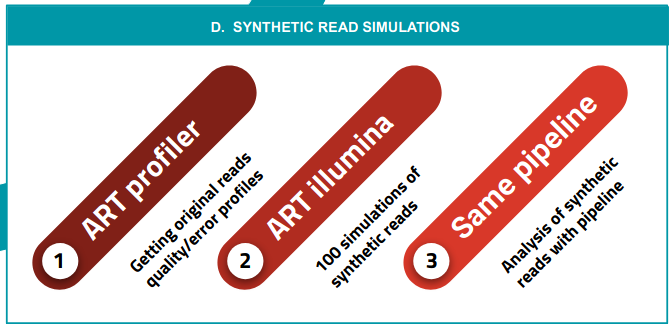
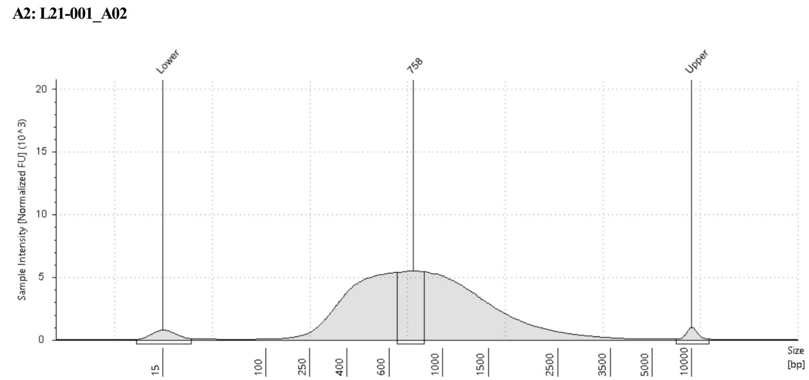

## Proyecto Bottleneck

~~~ bash
# Media & Mediana de genomas
[carlos@Koch zrun_bottleneck]$ cat *.meancov

G0076BottleNeck_mean_depth	264.944949056
G0076BottleNeck_median_depth	274.0
G0076BottleNeck_genome_coverage	0.979959569601
G76_mean_depth	56.5214263435
G76_median_depth	58.0
G76_genome_coverage	0.967151547354

G1180BottleNeck_mean_depth	362.549403019
G1180BottleNeck_median_depth	373.0
G1180BottleNeck_genome_coverage	0.98158961558
G1180_mean_depth	158.66146341
G1180_median_depth	165.0
G1180_genome_coverage	0.977134927277

G1181BottleNeck_mean_depth	208.757102975
G1181BottleNeck_median_depth	213.0
G1181BottleNeck_genome_coverage	0.979491478244
G1181_mean_depth	118.291111342
G1181_median_depth	122.0
G1181_genome_coverage	0.975182317617
~~~

#### Plantemos usar el proceso de Miguel para limpiar y definir los SNPs

Bioinformatic analysis

Read preprocessing was done using fastp40 to scan reads and trim low-quality ends with a mean window quality <20. We then used Kraken41 to taxonomically classify reads by means of a custom database, only keeping MTBC sequences to avoid false variants arising due to contaminant DNA. Filtered reads were mapped with BWA42 to a predicted MTBC ancestor reference sequence43 using default parameters, and processed using samtools44 and Picard45. After that, we scanned for optical and PCR duplicates to remove them, as this helps to reduce the number of artifactual variants in low-frequency ranges. Variant calling for sputum samples was carried out using the software and parameters from the calling module of the pipeline validated for sputum sample cultures at the IBV-CSIC (available at https://gitlab.com/tbgenomicsunit/ThePipeline).

For a robust variant calling in surgery samples, we used three different variant callers (VarScan246, GATK’s HaplotypeCaller46,47, LoFreq48) and integrated SNPs reported by at least two of them to get a high-confidence list of low-frequency variants. VarScan2 was run with parameters “pileup2snp sample.pileup—min-coverage 20—min-reads2 4—min-avg-qual 20—min-var-freq 0.01—min-freq-for-hom 0.9—strand-filter 1”, GATK was run with parameters “-T HaplotypeCaller -R ref.fasta -I sample.bam -o sample.vcf—min-base-quality-score 20 -ploidy 1” and LoFreq was run with parameters “call-parallel—pp-threads 12 -f ref.fasta -o sample.vcf sample.bam” and “filter -i sample.vcf -v 20 -A 0.01 -Q 20 -o filtered.vcf”.

From the initial list of variants, we applied a mapping filter that discarded variants that arose in repetitive genomic regions like the PE/PPE families or phages49. To establish a threshold that discarded additional false variants, we performed a synthetic read simulation. Using the ART software package50, we got the quality distribution and error profiles of our samples (using art_profiler_illumina with default parameters), and simulated 100 sequencing runs with the data (art_illumina -p −1 profile.txt -2 profile.txt -na -iref.fasta -l 150 -f 1000 -m 280 -s 137 -o out.fas). By analyzing simulations with the same pipeline, we defined a ~3% minimum frequency threshold to validate a variant in surgery samples. In addition, we extended our mapping filter to new regions that showed high-frequency SNPs in the simulations and were due to systematic mapping errors to the predicted ancestor, especially in Lineage 2 strains (see Supplementary Data 2 for a list of discarded genomic features).

#### Partimos de los archivos "*.fastq.gz", el proceso es el siguiente
> La carpeta de trabajo esta en Koch: /data/Carlos/bottleneck_pipeline

#### 1. ART Profiler
~~~ bash
ART_profiler_illumina/art_profiler_illumina G1180.error G1180_error_profile/ fastq

USAGE:
	./art_profiler_illumina output_profile_name input_fastq_dir fastq_filename_extension [max_number_threads]

PARAMETERS:
#	output_profile_name:  the name of read quality profile to be generated
#	input_fastq_dir:   the directory of input fastq or zipped fastq files
#	fastq_filename_extension: fastq or gzipped fastq filename extension
#	max_number_threads:: maximum number of threads/cores to be used for the run (default: all cores)
~~~

~~~ sh
#run
ART_profiler_illumina/art_profiler_illumina G0076.error G0076_error_profile/ fastq

#in
/data/Carlos/bottleneck_pipeline/ART/art_bin_MountRainier
~~~
#### 2. ART Illumina
> Los datos para ciertos parametros se obtienen en los reportes de las librerias (drive)

~~~ bash
#ART read simulation from MTB_ancestor
cat simNumber.txt | xargs -I {} -P 12 ~/ART/art_bin_MountRainier/art_illumina -p -1 G1180.error.txt -2 G1180.error.txt -na -i MTB_ancestor_reference.fasta -l 300 -f 350 -m 750 -s 500 -o sim{}\_R

#-p   --paired   indicate a paired-end read simulation or to generate reads from both ends of amplicons
#-1   --qprof1   the first-read quality profile
#-2   --qprof2   the second-read quality profile
#-na  --noALN    do not output ALN alignment file
#-i   --in       the filename of input DNA/RNA reference
#-l   --len      the length of reads to be simulated
#-f   --fcov     the fold of read coverage to be simulated or number of reads/read pairs generated for each amplicon
#-m   --mflen    the mean size of DNA/RNA fragments for paired-end simulations
#-s   --sdev     the standard deviation of DNA/RNA fragment size for paired-end simulations
#-o   --out      the prefix of output filename

#Read mapping
ls *fq | cut -d"_" -f1 | xargs -I {} -P 9 ~/ThePipeline/ThePipeline mapping -f {}\_R1.fq {}\_R2.fq -p {} -t 2

#Remove fastq files after mapping
rm *fq
rm *metrix

#Se guarda en
simulate_G1180.sh
~~~
~~~ bash
#Que contiene el archivo "simNumber.txt"
#Solo una lista del 1 al 100
[carlos@Koch simulations_G1180]$ head simNumber.txt
1
2
3
4
~~~
~~~ bash
-l   Tamaño de las reads en este caso: 300 (MiSeq)
-f   Profundidad en este caso: "373.0" / 350
-m   Tamaño medio de la fragmentacion de librerias: "758" / 750
-s   Desviacion estandar del Tamaño medio de la fragmentacion de librerias: 500
~~~

##### Scrip simulate_G1180.sh
~~~ sh
#BOTTLENECK READ SIMULATION AND ANALYSIS

#ART read simulation from H37Rv
cat simNumber.txt | xargs -I {} -P 12 ~/ART/art_bin_MountRainier/art_illumina -p -1 G1180.error.txt -2 G1180.error.txt -na -i MTB_ancestor_reference.fasta -l 300 -f 350 -m 750 -s 500 -o sim{}\_R

#read mapping
ls *fq | cut -d"_" -f1 | xargs -I {} -P 9 ~/ThePipeline/ThePipeline mapping -f {}\_R1.fq {}\_R2.fq -p {} -t 2

#remove fastq files after mapping
rm *fq
rm *metrix
~~~

#### 3. Same pipeline, parametros propuestos por Miguel

For a robust variant calling in surgery samples, we used three different variant callers (VarScan246, GATK’s HaplotypeCaller46,47, LoFreq48) and integrated SNPs reported by at least two of them to get a high-confidence list of low-frequency variants.

~~~ sh
#VarScan2 was run with parameters
	pileup2snp sample.pileup—min-coverage 20—min-reads2 4—min-avg-qual 20—min-var-freq 0.01—min-freq-for-hom 0.9—strand-filter 1
#Comando
#perform pileups before variant calling
ls *bam | cut -d"." -f1 | xargs -I {} -P 12 sh -c 'samtools mpileup -q 30 -Q 20 -BOf /data/Databases/MTB_ancestor/MTB_ancestor_reference.fasta $1.sort.bam > "$1.pileup"' -- {}
#varscan command
ls *pileup | cut -d"." -f1 | xargs -I {} -P 12 sh -c 'java -jar /data/ThePipeline_programs/VarScan/VarScan.v2.3.7.jar pileup2snp $1.pileup  --min-coverage 20 --min-reads2 4 --min-avg-qual 20 --min-var-freq 0.01 --min-freq-for-hom 0.9 --p-value 99e-2 --strand-filter 1 > "$1.snp"' -- {}

#lo introdusco en un sh para mandar nohup
nohup ./varscan_calling.sh &
~~~

~~~ sh
#GATK was run with parameters
	-T HaplotypeCaller -R ref.fasta -I sample.bam -o sample.vcf —min-base-quality-score 20 -ploidy 1
#Comando para crear index
/data/ThePipeline_programs/gatk-4.0.2.1/gatk CreateSequenceDictionary -R MTB_ancestor_reference.fasta

samtools faidx MTB_ancestor_reference.fasta
for i in *.bam; do samtools index $i;done

#Comando para ejecutar
ls *bam | cut -d"." -f1 | xargs -I {} -P 12 sh -c 'nice -n 5 /data/ThePipeline_programs/gatk-4.0.2.1/gatk HaplotypeCaller -R MTB_ancestor_reference.fasta -I $1.sort.bam -O $1.gatk.vcf --min-base-quality-score 20 -ploidy 1' -- {}

#lo introdusco en un sh para mandar nohup
nohup gatk_calling.sh &
~~~

~~~ sh
#LoFreq was run with parameters
	call-parallel --pp-threads 12 -f ref.fasta -o sample.vcf sample.bam
#and
	filter -i sample.vcf -v 20 -A 0.01 -Q 20 -o filtered.vcf

#comands LoFreq call
ls *bam | cut -d"." -f1 | xargs -I {} -P 12 sh -c 'nice -n 5 /data/Software/lofreq_star-2.1.3.1/bin/lofreq call-parallel --pp-threads 12 -f MTB_ancestor_reference.fasta -o $1.lofreq.vcf $1.sort.bam' -- {}

#and
ls *lofreq.vcf | cut -d"." -f1 | xargs -I {} -P 12 sh -c 'nice -n 5 /data/Software/lofreq_star-2.1.3.1/bin/lofreq filter -i $1.lofreq.vcf -v 20 -A 0.01 -Q 20 -o $1.filtered.vcf' -- {}

#lo introdusco en un sh para mandar nohup
nohup lofreq_calling.sh &
~~~
